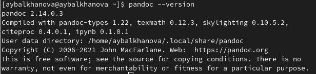
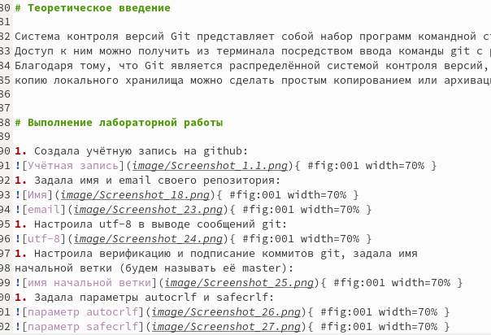

---
## Front matter
title: "Отчёт по лабораторной работе №3"
subtitle: "Операционные системы"
author: "Балханова Алтана Юрьевна"

## Generic otions
lang: ru-RU
toc-title: "Содержание"

## Bibliography
bibliography: bib/cite.bib
csl: pandoc/csl/gost-r-7-0-5-2008-numeric.csl

## Pdf output format
toc: true # Table of contents
toc-depth: 2
lof: true # List of figures
lot: true # List of tables
fontsize: 12pt
linestretch: 1.5
papersize: a4
documentclass: scrreprt
## I18n polyglossia
polyglossia-lang:
  name: russian
  options:
	- spelling=modern
	- babelshorthands=true
polyglossia-otherlangs:
  name: english
## I18n babel
babel-lang: russian
babel-otherlangs: english
## Fonts
mainfont: PT Serif
romanfont: PT Serif
sansfont: PT Sans
monofont: PT Mono
mainfontoptions: Ligatures=TeX
romanfontoptions: Ligatures=TeX
sansfontoptions: Ligatures=TeX,Scale=MatchLowercase
monofontoptions: Scale=MatchLowercase,Scale=0.9
## Biblatex
biblatex: true
biblio-style: "numeric"
biblatexoptions:
  - parentracker=true
  - backend=biber
  - hyperref=auto
  - language=auto
  - autolang=other*
  - citestyle=numeric
## Pandoc-crossref LaTeX customization
figureTitle: "Рис."
tableTitle: "Таблица"
listingTitle: "Листинг"
lofTitle: "Список иллюстраций"
lotTitle: "Список таблиц"
lolTitle: "Листинги"
## Misc options
indent: true
header-includes:
  - \usepackage{indentfirst}
  - \usepackage{float} # keep figures where there are in the text
  - \floatplacement{figure}{H} # keep figures where there are in the text
---

# Цель работы

Изучить идеологию и применение средств контроля версий, освоить
умения по работе с git.
Научиться оформлять отчёты с помощью легковесного языка разметки Markdown.

# Задание

– Сделать отчёт по предыдущей лабораторной работе в формате Markdown.

– В качестве отчёта предоставить отчёты в 3 форматах: pdf, docx и md (в архиве,
поскольку он должен содержать скриншоты, Makefile и т.д.)

# Теоретическое введение

Система контроля версий Git представляет собой набор программ командной строки.
Доступ к ним можно получить из терминала посредством ввода команды git с различными опциями.
Благодаря тому, что Git является распределённой системой контроля версий, резервную
копию локального хранилища можно сделать простым копированием или архивацией.

# Выполнение лабораторной работы
1. Скачала pandoc: (рис. [-@fig:001])

    { #fig:001 width=70% }

1. Создала учётную запись на github: (рис. [-@fig:002])

    { #fig:002 width=70% }

1. Задала имя и email своего репозитория: (рис. [-@fig:003], [-@fig:004])

    { #fig:003 width=70% }

    { #fig:004 width=70% }

1. Настроила utf-8 в выводе сообщений git: (рис. [-@fig:005])

    { #fig:005 width=70% }

1. Настроила верификацию и подписание коммитов git, задала имя начальной ветки (будем называть её master): (рис. [-@fig:006])

    { #fig:006 width=70% }

1. Задала параметры autocrlf и safecrlf: (рис. [-@fig:007], [-@fig:008])

    { #fig:007 width=70% }

    { #fig:008 width=70% }

1. Создала ключ ssh – по алгоритму rsa с ключём размером 4096 бит: (рис. [-@fig:009], [-@fig:010])

    { #fig:009 width=70% }
    
    { #fig:010 width=70% }

1. Создала ключ ssh – по алгоритму ed25519: (рис. [-@fig:011], [-@fig:012])

    { #fig:011 width=70% }
    
    { #fig:012 width=70% }

1. Создала ключи pgp: (рис. [-@fig:013])

    { #fig:013 width=70% }
    
    - Выбрала тип ключа RSA и RSA: (рис. [-@fig:014])
    	
    { #fig:014 width=70% }
    	
    - Выбрала размер ключа 4096: (рис. [-@fig:015])
    	
    { #fig:015 width=70% }
    	
    - Выбрала срок действия - неограничен: (рис. [-@fig:016])
    	
    { #fig:016 width=70% }
    	
    - Для составления идентификатора пользователя я ввела своё имя и адрес электронной почты: (рис. [-@fig:017])
    	
    { #fig:017 width=70% }
    	
    - Ввела фразу-пароль для защиты ключа: (рис. [-@fig:018])
    	
    { #fig:018 width=70% }
    	
    - Вывела список ключей и пыталась скопировать отпечаток приватного ключа: (рис. [-@fig:019], [-@fig:020])
    
    { #fig:019 width=70% }
    	
    { #fig:0020 width=70% }
    	
    - Но у меня это не получилось. Во время выполнения отчёта я поняла, что проблема была в том, что я не убрала угловые скобки <>, когда писала свой PGP Fingerprint. Но во время выполнения лабораторной работы, я зашла на github, где нашла, как вывести отпечаток ключа: (рис. [-@fig:020])
    
    { #fig:020 width=70% }
    	
    - Затем, я ввела эту команду, меняя данный пример отпечатка ключа на свой и скопировала выведенный ключ: (рис. [-@fig:021])
    
    { #fig:021 width=70% }
    	
    - После этого я перешла в настройки GitHub, нажала на кнопку New GPG key и вставила скопированный ключ в поле ввода: (рис. [-@fig:022])
    
    { #fig:022 width=70% }
    	
    - Так он выглядит: (рис. [-@fig:023])
    	
    { #fig:023 width=70% }
    	
1. Затем я попыталась настроить автоматические подписи коммитов git, но не убрала угловые скобки <>, из-за чего операция не удалась. Это я поняла только во время выполнения отчёта: (рис. [-@fig:024])

    { #fig:024 width=70% }

1. Закончила делать отчёт по второй лабораторной работе в Markdown (рис. [-@fig:025])

    { #fig:025 width=70% }

# Выводы

- Я изучила идеологию и применение средств контроля версий, освоила
умения по работе с git.

- Я научилась оформлять отчёты с помощью легковесного языка разметки Markdown.

