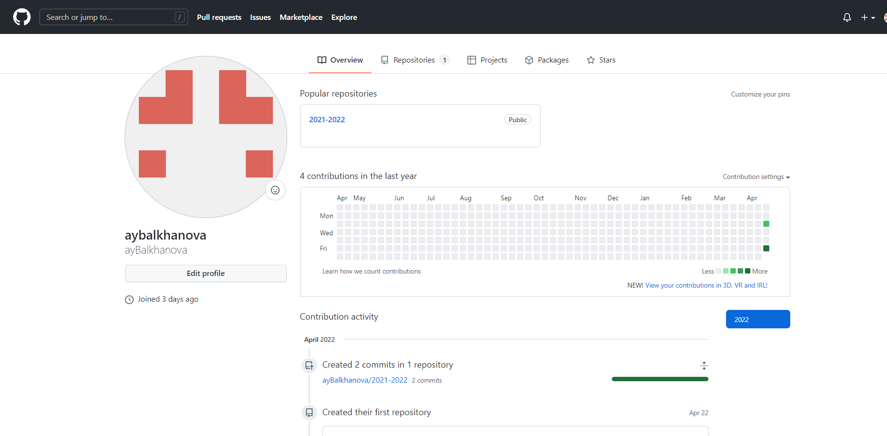

---
## Front matter
title: "Отчёт по лабораторной работе №3"
subtitle: "Операционные системы"
author: "Балханова Алтана Юрьевна"

## Generic otions
lang: ru-RU

## Bibliography
bibliography: bib/cite.bib
csl: pandoc/csl/gost-r-7-0-5-2008-numeric.csl

## Pdf output format
toc: true # Table of contents
toc-depth: 2
lof: true # List of figures
lot: true # List of tables
fontsize: 12pt
linestretch: 1.5
papersize: a4
documentclass: scrreprt
## I18n polyglossia
polyglossia-lang:
  name: russian
  options:
	- spelling=modern
	- babelshorthands=true
polyglossia-otherlangs:
  name: english
## I18n babel
babel-lang: russian
babel-otherlangs: english
## Fonts
mainfont: PT Serif
romanfont: PT Serif
sansfont: PT Sans
monofont: PT Mono
mainfontoptions: Ligatures=TeX
romanfontoptions: Ligatures=TeX
sansfontoptions: Ligatures=TeX,Scale=MatchLowercase
monofontoptions: Scale=MatchLowercase,Scale=0.9
## Biblatex
biblatex: true
biblio-style: "gost-numeric"
biblatexoptions:
  - parentracker=true
  - backend=biber
  - hyperref=auto
  - language=auto
  - autolang=other*
  - citestyle=gost-numeric
## Pandoc-crossref LaTeX customization
figureTitle: "Рис."
tableTitle: "Таблица"
listingTitle: "Листинг"
lofTitle: "Список иллюстраций"
lotTitle: "Список таблиц"
lolTitle: "Листинги"
## Misc options
indent: true
header-includes:
  - \usepackage{indentfirst}
  - \usepackage{float} # keep figures where there are in the text
  - \floatplacement{figure}{H} # keep figures where there are in the text
---

# Цель работы

Изучить идеологию и применение средств контроля версий, освоить
умения по работе с git.
Научиться оформлять отчёты с помощью легковесного языка разметки Markdown.

# Задание

– Сделать отчёт по предыдущей лабораторной работе в формате Markdown.
– В качестве отчёта предоставить отчёты в 3 форматах: pdf, docx и md (в архиве,
поскольку он должен содержать скриншоты, Makefile и т.д.)

# Теоретическое введение

Система контроля версий Git представляет собой набор программ командной строки.
Доступ к ним можно получить из терминала посредством ввода команды git с различными опциями.
Благодаря тому, что Git является распределённой системой контроля версий, резервную
копию локального хранилища можно сделать простым копированием или архивацией.

# Выполнение лабораторной работы
1. Скачала pandoc:
{ #fig:001 width=70% }
1. Создала учётную запись на github:
{ #fig:001 width=70% }
1. Задала имя и email своего репозитория:
{ #fig:001 width=70% }
{ #fig:001 width=70% }
1. Настроила utf-8 в выводе сообщений git:
{ #fig:001 width=70% }
1. Настроила верификацию и подписание коммитов git, задала имя
начальной ветки (будем называть её master):
{ #fig:001 width=70% }
1. Задала параметры autocrlf и safecrlf:
{ #fig:001 width=70% }
{ #fig:001 width=70% }
1. Создала ключ ssh – по алгоритму rsa с ключём размером 4096 бит:
{ #fig:001 width=70% }
{ #fig:001 width=70% }
1. Создала ключ ssh – по алгоритму ed25519:
{ #fig:001 width=70% }
{ #fig:001 width=70% }
1. Создала ключи pgp:
{ #fig:001 width=70% }
	- Выбрала тип ключа RSA и RSA:
	{ #fig:001 width=70% }
	- Выбрала размер ключа 4096:
	{ #fig:001 width=70% }
	- Выбрала срок действия - неограничен:
	{ #fig:001 width=70% }
	- Для составления идентификатора пользователя я ввела своё имя и адрес
электронной почты:
	{ #fig:001 width=70% }
	- Ввела фразу-пароль для защиты ключа:
	{ #fig:001 width=70% }
	- Вывела список ключей и пыталась скопировать отпечаток приватного
ключа:
	{ #fig:001 width=70% }
	{ #fig:001 width=70% }
	- Но у меня это не получилось. Во время выполнения отчёта я поняла, что
проблема была в том, что я не убрала угловые скобки <>, когда писала
свой PGP Fingerprint. Но во время выполнения лабораторной работы, я
зашла на github, где нашла, как вывести отпечаток ключа:
	{ #fig:001 width=70% }
	- Затем, я ввела эту команду, меняя данный пример отпечатка ключа на
свой и скопировала выведенный ключ:
	{ #fig:001 width=70% }
	- После этого я перешла в настройки GitHub, нажала на кнопку New GPG
key и вставила скопированный ключ в поле ввода:
	{ #fig:001 width=70% }
	- Так он выглядит:
	{ #fig:001 width=70% }
1. Затем я попыталась настроить автоматические подписи коммитов git, но
не убрала угловые скобки <>, из-за чего операция не удалась. Это я
поняла только во время выполнения отчёта:
{ #fig:001 width=70% }
1. Закончила делать отчёт по второй лабораторной работе в Markdown
{ #fig:001 width=70% }

# Выводы

- Я изучила идеологию и применение средств контроля версий, освоила
умения по работе с git.
- Я научилась оформлять отчёты с помощью легковесного языка разметки Markdown.

