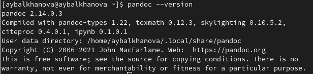

---
## Front matter
marp: true
lang: ru-RU
title: Презентация по лабораторной работе №3
author: |
	Балханова Алтана 
	НПМбд-03-21
institute: |
	\inst{1}RUDN University, Moscow, Russian Federation
date: NEC--2022, 28 April, 2022 Moscow, Russian Federation
## Formatting
toc: false
slide_level: 2
theme: metropolis
header-includes: 
 - \metroset{progressbar=frametitle,sectionpage=progressbar,numbering=fraction}
 - '\makeatletter'
 - '\beamer@ignorenonframefalse'
 - '\makeatother'
aspectratio: 43

---

# Презентация по лабораторной работе №3
Балханова Алтана 
НПМбд-03-21
RUDN University, Moscow, Russian Federation
28 April, 2022 Moscow, Russian Federation

---
# Лабораторная работа №3

---

## Цель работы

- Научиться оформлять отчёты с помощью легковесного языка разметки Markdown.

---
## Задание

– Сделать отчёт по предыдущей лабораторной работе в формате Markdown.

– Предоставить отчёты в 3 форматах: pdf, docx и md (в архиве,
поскольку он должен содержать скриншоты, Makefile и т.д.)

---

## Markdown


Markdown — облегчённый язык разметки, созданный с целью обозначения форматирования в простом тексте, с максимальным сохранением его читаемости человеком, и пригодный для машинного преобразования в языки для продвинутых публикаций

---

## Выполнение второй лабораторной работы в markdown


###### Рис.1: отчёт в markdown

---
## Работа с pandoc

###### Рис.2: версия pandoc
Преобразовала файл, используя
```
pandoc README.md -o README.pdf
pandoc README.md -o README.docx
```

---
## Вывод

Я научилась оформлять отчёты с помощью легковесного языка разметки Markdown.

---
  # Спасибо за внимание

