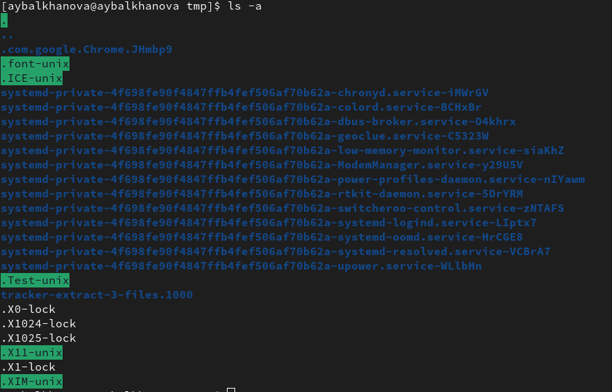
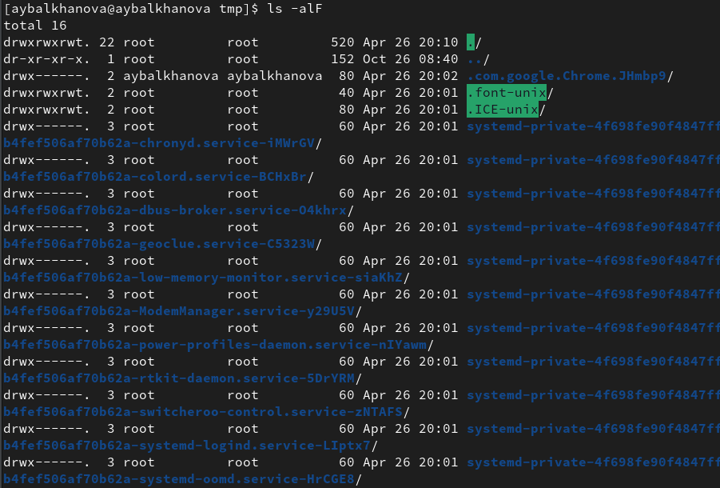
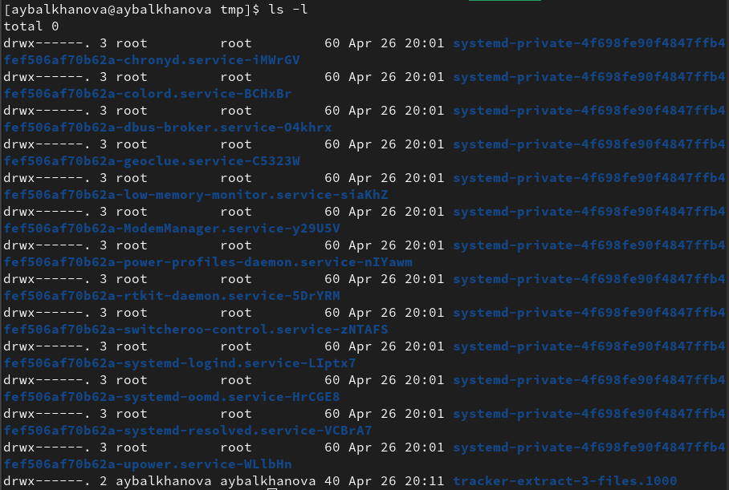
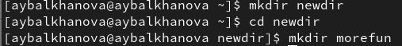
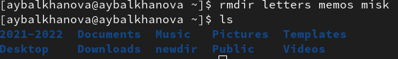
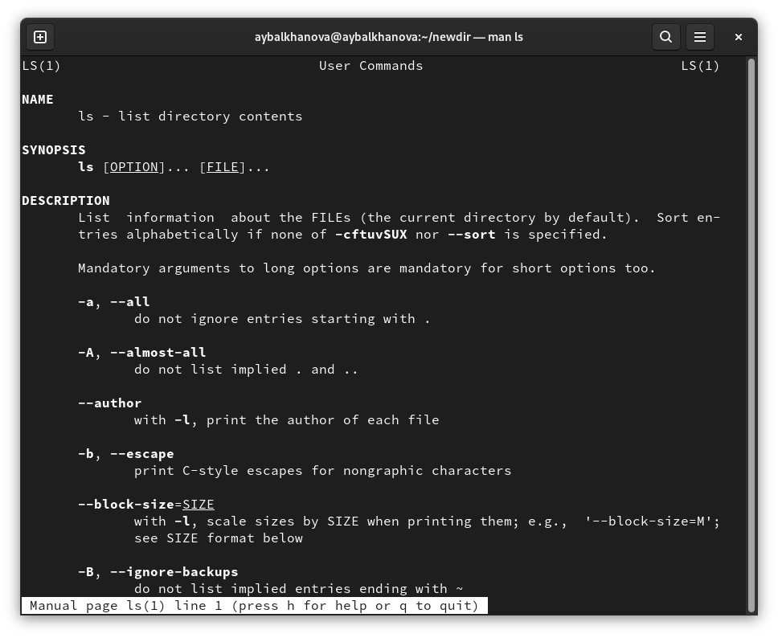
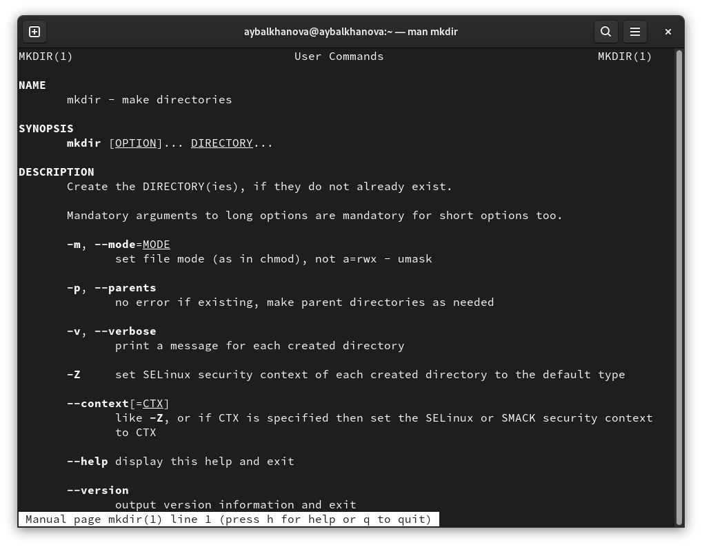
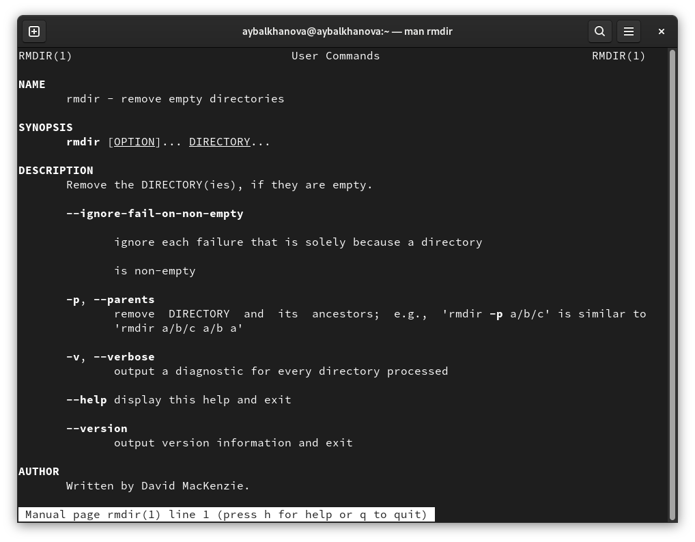
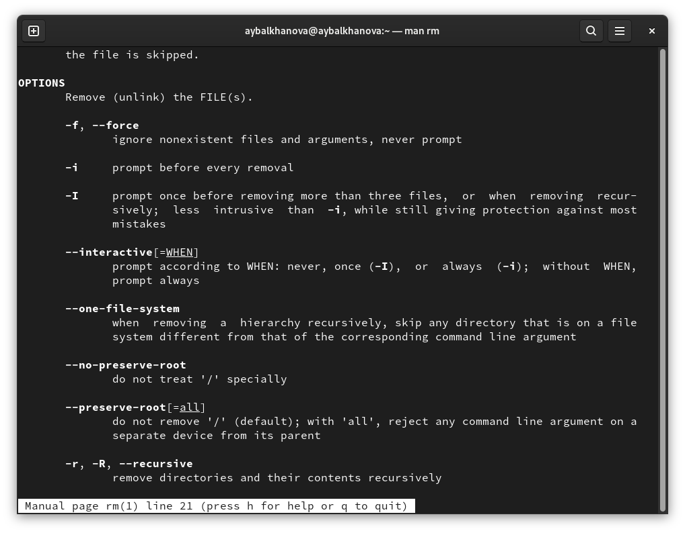

---
## Front matter
title: "Отчёт по лабораторной работе №4"
subtitle: "Операционные системы"
author: "Балханова Алтана Юрьевна"

## Generic otions
lang: ru-RU
toc-title: "Содержание"

## Bibliography
bibliography: bib/cite.bib
csl: pandoc/csl/gost-r-7-0-5-2008-numeric.csl

## Pdf output format
toc: true # Table of contents
toc-depth: 2
lof: true # List of figures
lot: true # List of tables
fontsize: 12pt
linestretch: 1.5
papersize: a4
documentclass: scrreprt
## I18n polyglossia
polyglossia-lang:
  name: russian
  options:
	- spelling=modern
	- babelshorthands=true
polyglossia-otherlangs:
  name: english
## I18n babel
babel-lang: russian
babel-otherlangs: english
## Fonts
mainfont: PT Serif
romanfont: PT Serif
sansfont: PT Sans
monofont: PT Mono
mainfontoptions: Ligatures=TeX
romanfontoptions: Ligatures=TeX
sansfontoptions: Ligatures=TeX,Scale=MatchLowercase
monofontoptions: Scale=MatchLowercase,Scale=0.9
## Biblatex
biblatex: true
biblio-style: "gost-numeric"
biblatexoptions:
  - parentracker=true
  - backend=biber
  - hyperref=auto
  - language=auto
  - autolang=other*
  - citestyle=gost-numeric
## Pandoc-crossref LaTeX customization
figureTitle: "Рис."
tableTitle: "Таблица"
listingTitle: "Листинг"
lofTitle: "Список иллюстраций"
lotTitle: "Список таблиц"
lolTitle: "Листинги"
## Misc options
indent: true
header-includes:
  - \usepackage{indentfirst}
  - \usepackage{float} # keep figures where there are in the text
  - \floatplacement{figure}{H} # keep figures where there are in the text
---

# Цель работы

Приобрести практические навыки взаимодействия пользователя с системой посредством командной строки.

# Выполнение лабораторной работы
1. С помощью команды pwd определила полное имя домашнего каталога
{ #fig:001 width=70% }
1. 
	1. Перешла в каталог /tmp, с помощью команды ls вывела содержимое на экран
	{ #fig:001 width=70% }
	1. Используя опцию а, вывела содержимое на экран, включая скрытые файлы
	{ #fig:001 width=70% }
	1. Используя опцию аlF, вывела содержимое с подробно информацией на экран, включая скрытые файлы
	{ #fig:001 width=70% }
	1. Используя опцию l, вывела содержимое с подробной информацией на экран
	{ #fig:001 width=70% }
	1. Используя опцию F, вывела содержимое на экран. Он пазывает тип и имя файлов.
	{ #fig:001 width=70% }
	1. Определила, что в каталоге /var/spool нет подкаталога с именем cron
	{ #fig:001 width=70% }
	1. Перешла в домашний каталог и использовала команду ls для вывода содержимого
	{ #fig:001 width=70% }
	1. Используя команду ls -alF определила, что владельцем файлов и подкаталогов является aybalkhanova
	{ #fig:001 width=70% }
1. 
	1. В домашнем каталоге создала каталог newdir и создала внутри него каталог morefun
	{ #fig:001 width=70% }
	1. В домашнем каталоге создала каталоги с именами letters, memos, misk
	{ #fig:001 width=70% }
	1. Затем удалила эти каталоги одной командой rmdir
	{ #fig:001 width=70% }
	1. Попробовала удалить ранее созданный каталог ~/newdir командой rm. Сделать это не получилось, так как нужно было использовать опцию -r
	{ #fig:001 width=70% }
	1. Удалила каталог ~/newdir/morefun из домашнего каталога
	{ #fig:001 width=70% }
1. С помощью команды man ls определила, какую опцию команды ls нужно использовать для просмотра содержимое не только указанного каталога, но и подкаталогов.
{ #fig:001 width=70% }
Опция R выполняет эту задачу
{ #fig:001 width=70% }
{ #fig:001 width=70% }
1. С помощью команды man ls определила, какую опцию команды ls нужно использовать, чтобы отсортировать по времени последнего изменения выводимый список содержимого каталога с развёрнутым описанием файлов.
Опция с выполняет эту задачу
{ #fig:001 width=70% }
{ #fig:001 width=70% }
1. Использовала команду man для просмотра описания следующих команд: cd, pwd, mkdir, rmdir, rm. 
	1. У команды cd нет опций
	{ #fig:001 width=70% }
	1. 
	* -L, --logical - брать директорию из переменной окружения, даже если она содержит символические ссылки;
	* -P - отбрасывать все символические ссылки;
	* --help - отобразить справку по утилите;
	* --version - отобразить версию утилиты.
	{ #fig:001 width=70% }
	1. 
	* -m (--mode=режим) - назначить режим доступа (права). 
	* -p (--parents) - не показывать ошибки, а также их игнорировать.
	* -z (--context=CTX ) принимает контекст SELinux для каталога по умолчанию.
	* -v (--verbose) - выводить сообщение о каждом новым каталоге.
	* --help - вывести справочную информацию.
	{ #fig:001 width=70% }
	1. 
	* -p - позволяет удалить каталог и вышележащие каталоги, оказавшиеся пустыми.
	* -v - выводит диагностику для каждого обработанного каталога
	{ #fig:001 width=70% }
	1. 
	* -f или --force - игнорировать несуществующие файлы и аргументы. Никогда не выдавать запросы на подтверждение удаления.
	* -i - выводить запрос на подтверждение удаления каждого файла.
	* -r или -R или --recursive - удаление директорий и их содержимого. Рекурсивное удаление.
	* -d или --dir - удалять пустые директории.
	* -v или --verbose - выводить информацию об удаляемых файлах.
	{ #fig:001 width=70% }
1. Используя информацию, полученную при помощи команды history, выполнила модификацию и исполнение нескольких команд из буфера команд.
{ #fig:001 width=70% }
Исправила опечатку в команде man
{ #fig:001 width=70% }
Команда начала работать
{ #fig:001 width=70% }
Поменяла опцию ls 
{ #fig:001 width=70% }

# Контрольные вопросы
1. Командная строка - текстовый интерфейс для компьютера. 
1. С помощью команды pwd. Например, я ввела эту команду в домашнем каталоге и он вывел /home/aybalkhanova.
1. Команда ls c опцией F. Например, в пункте 2.5. можно видеть, как она работает.
1. Команда ls c опцией а. Например, в пункте 2.2. можно видеть, как она работает.
1. Команда rm удаляет файлы и каталоги. rm c опцией r удалит каталог. Например, если в домашнем каталоге будет каталог newdir, то введя команду rm -r newdir, каталог удалится.
1. Для вывода на экран списка ранее выполненных команд используется команда history.
1. Можно модифицировать команду из выведенного на экран списка при помощи следующей конструкции:
!<номер_команды>:s/<что_меняем>/<на_что_меняем>
Пример:
```
1 !3:s/a/F
2 ls -F
```
1. Если требуется выполнить последовательно несколько команд, записанный в одной строке, то для этого используется символ точка с запятой:
```
cd; ls
```
1. Экранирование символов
Чтобы использовать специальный символ как обычный, добавьте к нему обратную косую черту: \. . Это называется «экранирование символа».
1. Вывод в длинном формате: перед именами файлов выдается режим доступа, количество ссылок на файл, имена владельца и группы, размер в байтах и время последней модификации. Если файл является специальным, то в поле размера выводится старший и младший номера устройства.
1. Относительный путь к файлу от текущего каталога — это путь к файлу относительно текущего каталога. Наприме, для удаления подкаталога можно зайти в каталог, содержащий каталог с этимс каталого и удалить его, использую относительный путь, в можно удалить его, используя полный, абсолютный путь, никуда не перемещаясь.
1. Команда man поможет получить информацию о интересующей вас команде.
1. Клавиша tab служаит для автоматического дополнения вводимых команд.

# Выводы

Я приобрела практические навыки взаимодействия пользователя с системой посредством командной строки.
