---
## Front matter
lang: ru-RU
title: Презентация по лабораторной работе №4
author: |
	Балханова Алтана 
	НПМбд-03-21
institute: |
	\inst{1}RUDN University, Moscow, Russian Federation
date: NEC--2022, 25 April, 2022 Moscow, Russian Federation
## Formatting
toc: false
slide_level: 2
theme: metropolis
header-includes: 
 - \metroset{progressbar=frametitle,sectionpage=progressbar,numbering=fraction}
 - '\makeatletter'
 - '\beamer@ignorenonframefalse'
 - '\makeatother'
aspectratio: 43
section-titles: true
---

# Лабораторная работа №4

## Цель работы

Приобрести практические навыки взаимодействия пользователя с системой посредством командной строки.

## Команда ls и её опции
1. Опция а выводит содержимое на экран, включая скрытые файлы(рис. [-@fig:001])
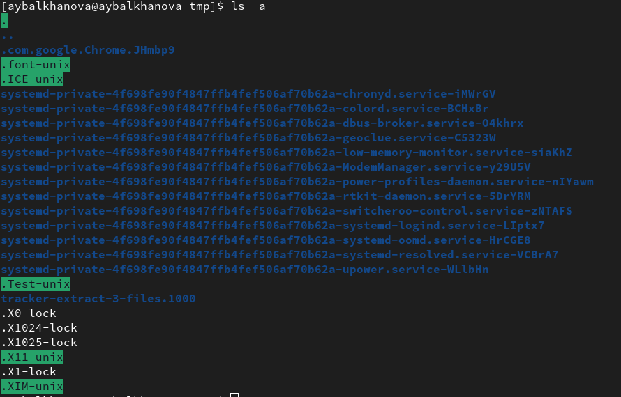{ #fig:001 width=70% }
1. Опция аlF выводит содержимое с подробной информацией на экран, включая скрытые файлы(рис. [-@fig:002])
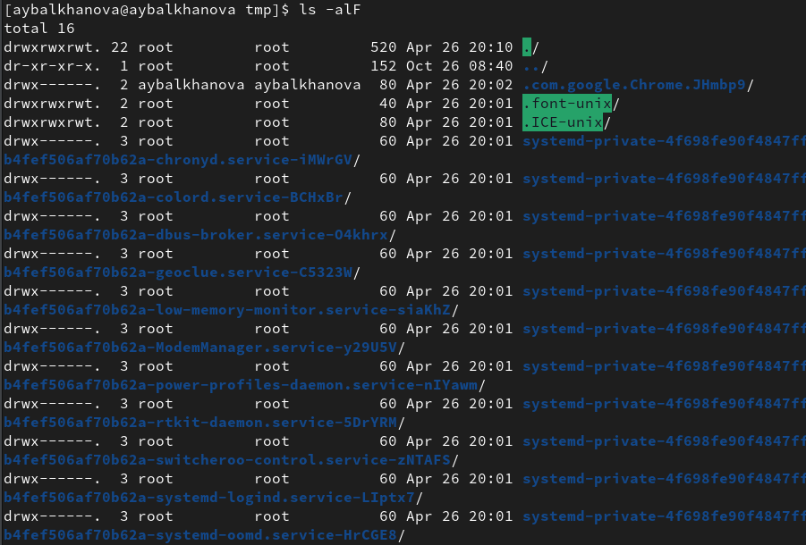{ #fig:002 width=70% }
1. Опция l выводит содержимое с подробной информацией на экран(рис. [-@fig:003])
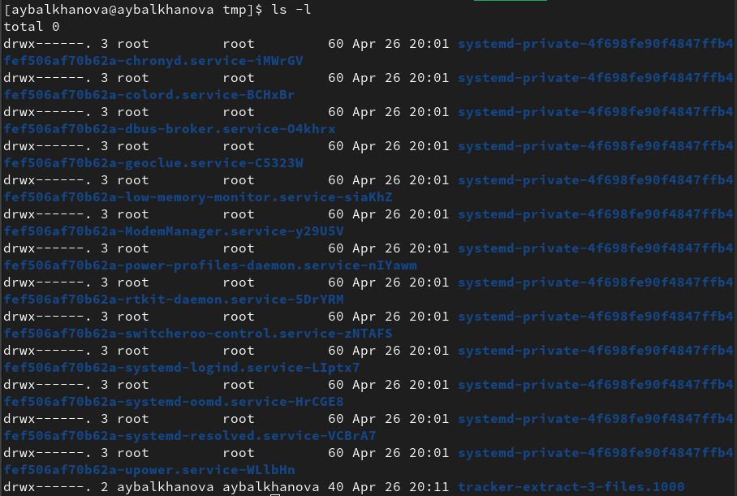{ #fig:003 width=70% }
1. Опция F выводит содержимое на экран и показывает тип и имя файлов.(рис. [-@fig:004])
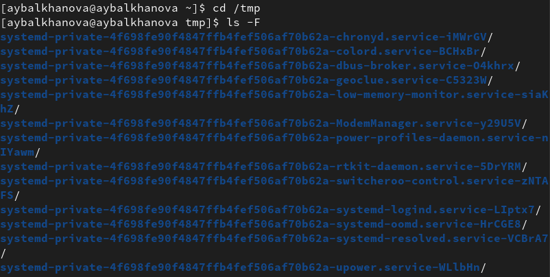{ #fig:004 width=70% }

## Работа с каталогами
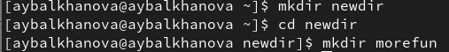{ #fig:005 width=70% }
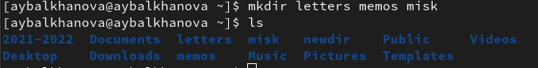{ #fig:006 width=70% }
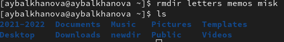{ #fig:007 width=70% }

### Команда man
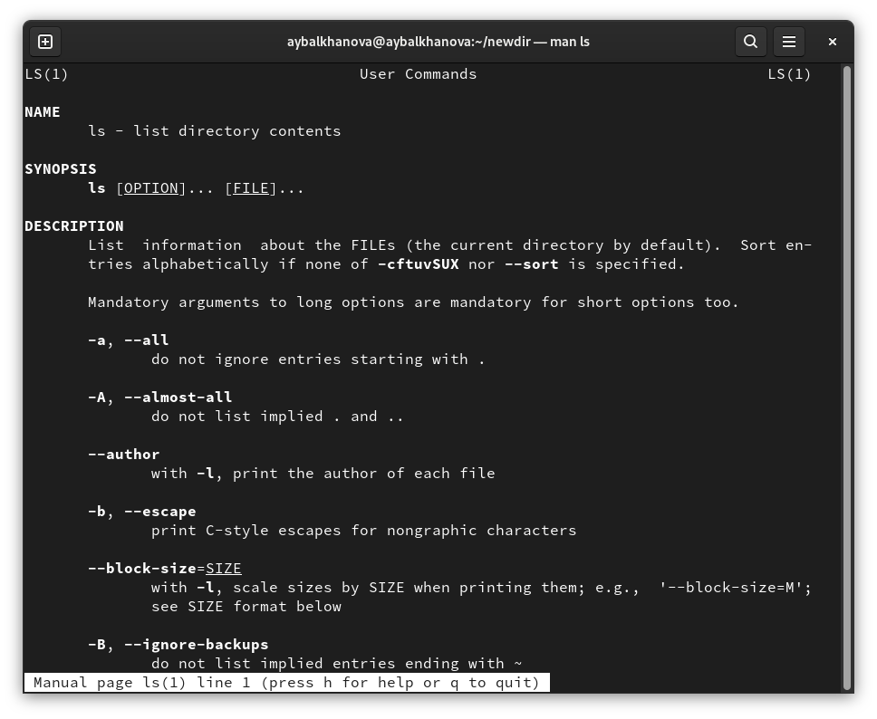{ #fig:008 width=70% }
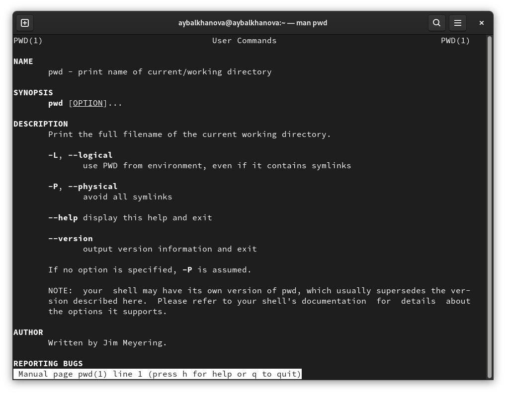{ #fig:009 width=70% }
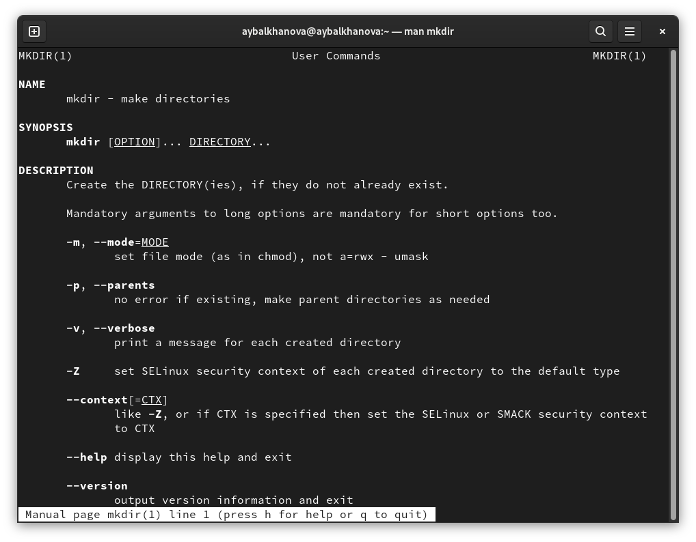{ #fig:010 width=70% }
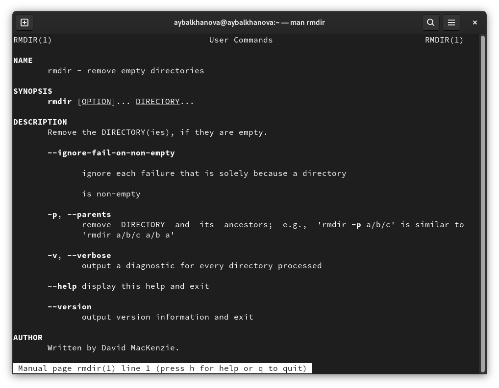{ #fig:011 width=70% }
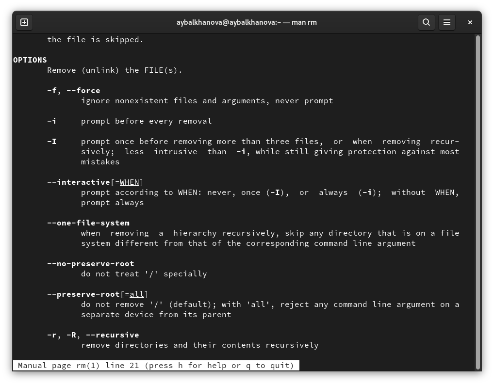{ #fig:012 width=70% }

## Команда history
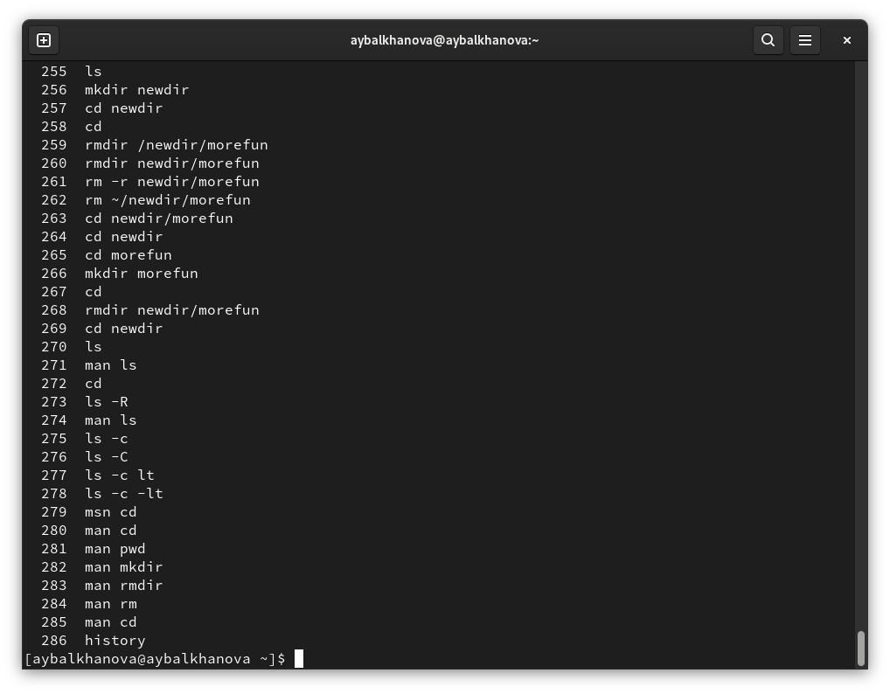{ #fig:013 width=70% }

## Вывод
Я приобрела практические навыки взаимодействия пользователя с системой посредством командной строки.

## {.standout}

Спасибо за внимание
