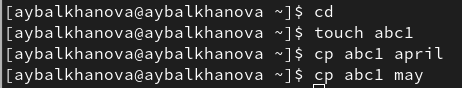
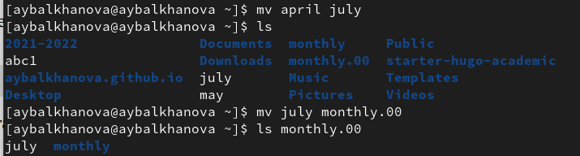
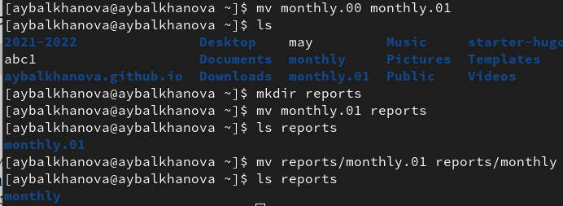
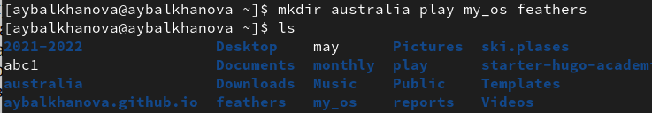
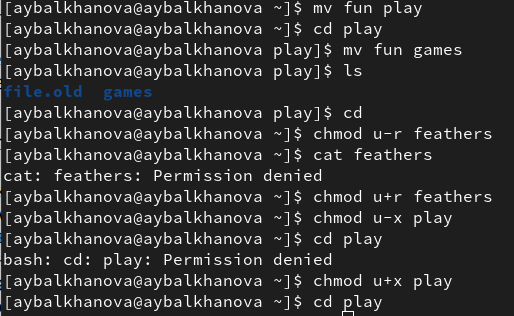

---
## Front matter
title: "Отчёт по лабораторной работе №5"
subtitle: "Операционные системы"
author: "Балханова Алтана Юрьевна"

## Generic otions
lang: ru-RU
toc-title: "Содержание"

## Bibliography
bibliography: bib/cite.bib
csl: pandoc/csl/gost-r-7-0-5-2008-numeric.csl

## Pdf output format
toc: true # Table of contents
toc-depth: 2
lof: true # List of figures
lot: true # List of tables
fontsize: 12pt
linestretch: 1.5
papersize: a4
documentclass: scrreprt
## I18n polyglossia
polyglossia-lang:
  name: russian
  options:
	- spelling=modern
	- babelshorthands=true
polyglossia-otherlangs:
  name: english
## I18n babel
babel-lang: russian
babel-otherlangs: english
## Fonts
mainfont: PT Serif
romanfont: PT Serif
sansfont: PT Sans
monofont: PT Mono
mainfontoptions: Ligatures=TeX
romanfontoptions: Ligatures=TeX
sansfontoptions: Ligatures=TeX,Scale=MatchLowercase
monofontoptions: Scale=MatchLowercase,Scale=0.9
## Biblatex
biblatex: true
biblio-style: "numeric"
biblatexoptions:
  - parentracker=true
  - backend=biber
  - hyperref=auto
  - language=auto
  - autolang=other*
  - citestyle=numeric
## Pandoc-crossref LaTeX customization
figureTitle: "Рис."
tableTitle: "Таблица"
listingTitle: "Листинг"
lofTitle: "Список иллюстраций"
lotTitle: "Список таблиц"
lolTitle: "Листинги"
## Misc options
indent: true
header-includes:
  - \usepackage{indentfirst}
  - \usepackage{float} # keep figures where there are in the text
  - \floatplacement{figure}{H} # keep figures where there are in the text
---

# Цель работы

Ознакомиться с файловой системой Linux, её структурой, именами и содержанием каталогов. Приобрести практические навыки по применению команд для работы с файлами и каталогами, по управлению процессами (и работами), по проверке использования диска и обслуживанию файловой системы.

# Выполнение лабораторной работы
1. 
	1. Скопировала файл abc1 в файл april, may:

		{ #fig:001 width=70% }
		
	1. Скопировала несколько файлов в каталог monthly:

		{ #fig:002 width=70% }
		
	1. Cкопировала файл may в файл с именем june:

		{ #fig:003 width=70% }
		
	1. Скопировала каталог в текущем и в произвольном каталогах:

		{ #fig:004 width=70% }
		
	1. Переименовала файл april и переместила его в каталог monthly.00:

		{ #fig:005 width=70% }
		
	1. Переименовала каталог monthly.00 и переместила его в другой каталог reports, снова переименовала его:

		{ #fig:006 width=70% }
		
	1. Создала файл may с правом выполнения для владельца:

		{ #fig:007 width=70% }
		
	1. Лишила владельца файла may права на выполнение:

		{ #fig:008 width=70% }
		
	1. Создала каталог monthly с запретом на чтение для членов группы и всех остальных пользователей:

		{ #fig:009 width=70% }
		
	1. Создала файл abc1 с правом записи для членов группы:

		{ #fig:010 width=70% }
		
1. 
	1. Скопировала файл /usr/include/sys/io.h в домашний каталог и назвала его equipment. В домашнем каталоге создала директорию ski.plases. Переместила файл equipment в каталог ski.plases. Переименовала файл equipment в equiplist.

		{ #fig:011 width=70% }

	1. Создала в домашнем каталоге файл abc1 и скопировала его в каталог ski.plases, назвала его equiplist2. Создала каталог с именем equipment в каталоге ski.plases. Переместила файлы equiplist и equiplist2 в каталог equipment.

		{ #fig:012 width=70% }
			
	1. Переместила каталог newdir в каталог ski.plases и переименовала его в plans:

		{ #fig:013 width=70% }

1. 
	1. Создала нужные файлы: 

		{ #fig:014 width=70% }
		
	1. Выделила нужные права доступа созданным каталогам:

		{ #fig:015 width=70% }
		
		{ #fig:016 width=70% }
		
1. 
	1. Попыталась посмотреть содержимое файла /etc/password, но такого файла нет
	1. Cкопировала файл feathers в файл file.old. Переместила file.old в каталог play.
		
		{ #fig:017 width=70% }
		
	1. Скопировала каталог play в каталог fun. Переместите каталог fun в каталог play и переименовала его в games. Лишила владельца файла feathers права на чтение. Будет отказано в доступе, если попытаться просмотреть файл. Будет отказано в доступе, если попытаться скопировать файл. Вернула права на чтение.  Лишите владельца каталога play права на выполнение. Будет отказано в доустпе, если попытаться перейти в каталог play. Вернула права на выполнение.

		{ #fig:018 width=70% }

1. Команда man
	1. Команда mount служит для подключения файловых систем разных устройств к этому большому дереву.

		{ #fig:019 width=70% }

	1. Команда fsck - проверка согласованности файловой системы) проверяет файловые системы на наличие ошибок или нерешенных проблем.

		{ #fig:020 width=70% }

	1. mkfs используется для создания файловой системы Linux на некотором устройстве, обычно в разделе жёсткого диска.

		{ #fig:021 width=70% }

	1. Команда kill является встроенной командой командной оболочки, предназначенной для отправки системных сигналов определенным процессам.  Команда принимает числовые идентификаторы процессов, а также числовые или текстовые идентификаторы сигналов. Чаще всего данная команда используется для принудительного завершения работы определенных процессов.

		{ #fig:022 width=70% }

# Контрольные вопросы
1. Btrfs (B-tree FS, «Better FS» или «Butter FS») — файловая система для Linux, основанная на структурах B-деревьев и работающая по принципу «копирование при записи» (copy-on-write). В файловой системе, файловая система копирует данные, изменяет данные, а затем записывает измененные данные обратно в другое свободное место файловой системы. Ext4 (англ. fourth extended file system, ext4fs) — журналируемая файловая система, используемая преимущественно в операционных системах с ядром Linux, созданная на базе ext3 в 2006 году. Основные изменения по сравнению с ext3: увеличение максимального объёма одного раздела диска до 1 эксбибайта (260 байт) при размере блока 4 кибибайт; увеличение размера одного файла до 16 тебибайт (244 байт); введение механизма пространственной (extent) записи файлов, уменьшающего фрагментацию и повышающего производительность. Суть механизма заключается в том, что новая информация добавляется в конец области диска, выделенной заранее по соседству с областью, занятой содержимым файла.
1. / — root каталог. Содержит в себе всю иерархию системы; /bin — здесь находятся двоичные исполняемые файлы. Основные общие команды, хранящиеся отдельно от других программ в системе (прим.: pwd, ls, cat, ps); /boot — тут расположены файлы, используемые для загрузки системы (образ initrd, ядро vmlinuz); /dev — в данной директории располагаются файлы устройств (драйверов). С помощью этих файлов можно взаимодействовать с устройствами. К примеру, если это жесткий диск, можно подключить его к файловой системе. В файл принтера же можно написать напрямую и отправить задание на печать; etc — в этой директории находятся файлы конфигураций программ. Эти файлы позволяют настраивать системы, сервисы, скрипты системных демонов; /home — каталог, аналогичный каталогу Users в Windows. Содержит домашние каталоги учетных записей пользователей (кроме root). При создании нового пользователя здесь создается одноименный каталог с аналогичным именем и хранит личные файлы этого пользователя; /lib — содержит системные библиотеки, с которыми работают программы и модули ядра; /lost+found — содержит файлы, восстановленные после сбоя работы системы. Система проведет проверку после сбоя и найденные файлы можно будет посмотреть в данном каталоге; /media — точка монтирования внешних носителей. Например, когда вы вставляете диск в дисковод, он будет автоматически смонтирован в директорию /media/cdrom; /mnt — точка временного монтирования. Файловые системы подключаемых устройств обычно монтируются в этот каталог для временного использования; /opt — тут расположены дополнительные (необязательные) приложения. Такие программы обычно не подчиняются принятой иерархии и хранят свои файлы в одном подкаталоге (бинарные, библиотеки, конфигурации); /proc — содержит файлы, хранящие информацию о запущенных процессах и о состоянии ядра ОС; /root — директория, которая содержит файлы и личные настройки суперпользователя; /run — содержит файлы состояния приложений. Например, PID-файлы или UNIX-сокеты; /sbin — аналогично /bin содержит бинарные файлы. Утилиты нужны для настройки и администрирования системы суперпользователем; /srv — содержит файлы сервисов, предоставляемых сервером (прим. FTP или Apache HTTP); /sys — содержит данные непосредственно о системе. Тут можно узнать информацию о ядре, драйверах и устройствах; /tmp — содержит временные файлы. Данные файлы доступны всем пользователям на чтение и запись. Стоит отметить, что данный каталог очищается при перезагрузке; /usr — содержит пользовательские приложения и утилиты второго уровня, используемые пользователями, а не системой. Содержимое доступно только для чтения (кроме root). Каталог имеет вторичную иерархию и похож на корневой; /var — содержит переменные файлы. Имеет подкаталоги, отвечающие за отдельные переменные. Например, логи будут храниться в /var/log, кэш в /var/cache, очереди заданий в /var/spool/ и т.д.
1. Монтирование - mount.
1. Отсутствие синхронизации между образом файловой системы в памяти и ее данными на диске в случае аварийного останова может привести к появлению следующих ошибок: jдин блок адресуется несколькими mode, блок помечен как свободный, но в то же время занят, блок помечен как занятый, но в то же время свободен, неправильное число ссылок в inode. Командой fsck можно восстановить файловую систему.
1. Команда mkfs создаёт файловую систему.
1. Cat считывает данные из файлов и выводит их содержимое.
1. Копирование файлов и каталогов в разные файлы, каталоги.
1. Перемещение и переименование файлов и каталогов.
1. Права доступа — совокупность правил, регламентирующих порядок и условия доступа субъекта к объектам информационной системы. Изменить их можно командой chmod.

# Выводы

Я ознакомилась с файловой системой Linux, её структурой, именами и содержанием каталогов, приобрела практические навыки по применению команд для работы с файлами и каталогами, по управлению процессами (и работами), по проверке использования диска и обслуживанию файловой системы.
