---
## Front matter
title: "Отчёт по лабораторной работе №6"
subtitle: "Операционные системы"
author: "Балханова Алтана Юрьевна"

## Generic otions
lang: ru-RU
toc-title: "Содержание"

## Bibliography
bibliography: bib/cite.bib
csl: pandoc/csl/gost-r-7-0-5-2008-numeric.csl

## Pdf output format
toc: true # Table of contents
toc-depth: 2
lof: true # List of figures
lot: true # List of tables
fontsize: 12pt
linestretch: 1.5
papersize: a4
documentclass: scrreprt
## I18n polyglossia
polyglossia-lang:
  name: russian
  options:
	- spelling=modern
	- babelshorthands=true
polyglossia-otherlangs:
  name: english
## I18n babel
babel-lang: russian
babel-otherlangs: english
## Fonts
mainfont: PT Serif
romanfont: PT Serif
sansfont: PT Sans
monofont: PT Mono
mainfontoptions: Ligatures=TeX
romanfontoptions: Ligatures=TeX
sansfontoptions: Ligatures=TeX,Scale=MatchLowercase
monofontoptions: Scale=MatchLowercase,Scale=0.9
## Biblatex
biblatex: true
biblio-style: "numeric"
biblatexoptions:
  - parentracker=true
  - backend=biber
  - hyperref=auto
  - language=auto
  - autolang=other*
  - citestyle=numeric
## Pandoc-crossref LaTeX customization
figureTitle: "Рис."
tableTitle: "Таблица"
listingTitle: "Листинг"
lofTitle: "Список иллюстраций"
lotTitle: "Список таблиц"
lolTitle: "Листинги"
## Misc options
indent: true
header-includes:
  - \usepackage{indentfirst}
  - \usepackage{float} # keep figures where there are in the text
  - \floatplacement{figure}{H} # keep figures where there are in the text
---

# Цель работы

Ознакомиться с инструментами поиска файлов и фильтрации текстовых данных. Приобрести практические навыки по управлению процессами и заданиями, по проверке использования диска и обслуживанию файловых систем.

# Выполнение лабораторной работы

1. Осуществила вход в систему, используя соответствующее имя пользователя: aybalkhanova.
1. Записала в файл file.txt названия файлов, содержащихся в каталоге /etc, используяю команду ls -R /etc > file.txt. Затем добавила в этот же файл названия файлов, содержащихся в домашнем каталоге, используя команду ls -R ~ >> file.txt (рис. 0.1). Просмотрела содержимое командой cat file.txt (рис. 0.2).
	
	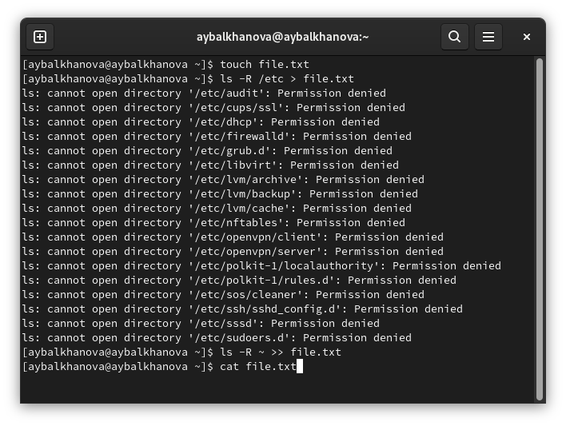{ #fig:001 width=70% }
	
	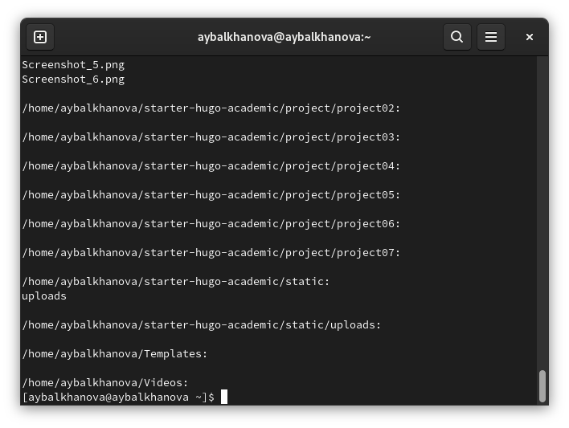{ #fig:002 width=70% }
	
1. Записала все файлы из file.txt, имеющих расширение .conf, в новый текстовой файл conf.txt, просмотрела содержимое (рис. 0.3).
	
	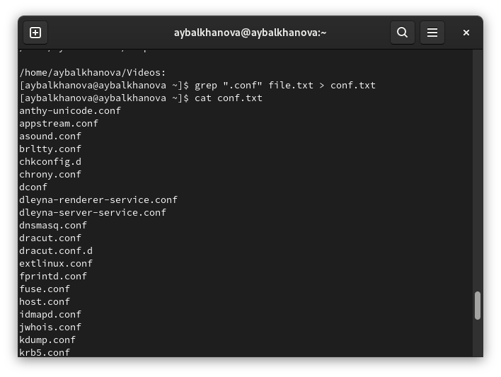{ #fig:003 width=70% }
	
1. Определила, какие файлы в домашнем каталоге имеют имена, начинавшиеся с символа c, командами ls -l | grep c* и find ~ -name `c*` -print (рис. 0.4).
	
	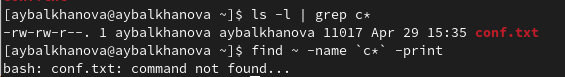{ #fig:004 width=70% }
	
1. Вывела на экран (по странично) имена файлов из каталога /etc, начинающиеся с символа h (рис 0.6) командой find /etc -name "h*" -print  | less (рис. 0.5)

	{ #fig:005 width=70% }
	
	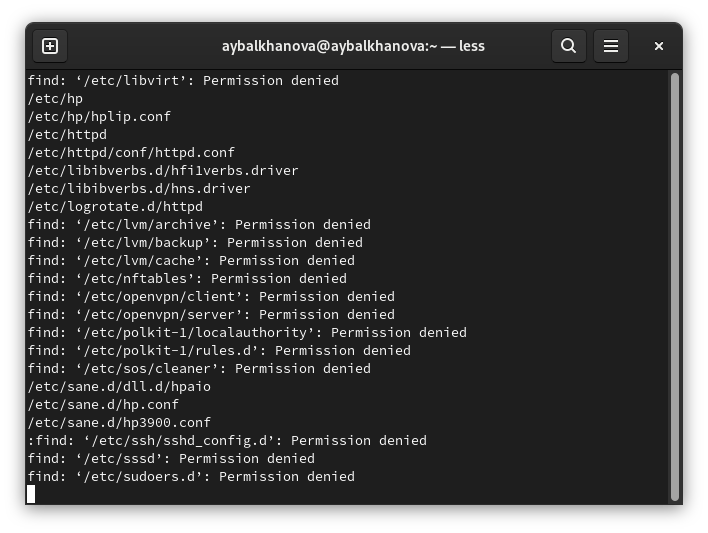{ #fig:006 width=70% }

1. Запустила в фоновом режиме процесс, который будет записывать в файл ~/logfile файлы, имена которых начинаются с log командой find /etc -name "log*" > logfile & и удалила файл (рис 0.7).

	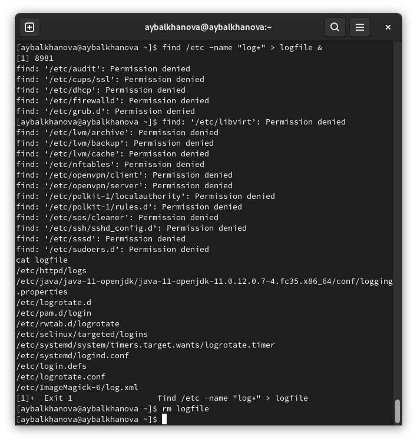{ #fig:007 width=70% }

1. Запустила из консоли в фоновом режиме редактор gedit, добавив & после команды. Определила идентификатор процесса gedit - 7470, используя команду ps aux | grep gedit, pidof gedit, pgrep gedit (рис 0.8).

	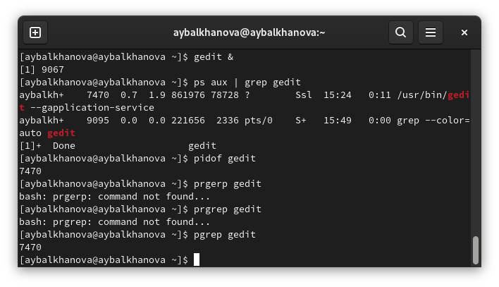{ #fig:008 width=70% }

1. Прочла справку команды kill (рис. 0.9), после чего использовала её для завершения процесса gedit (рис. 0.10).

	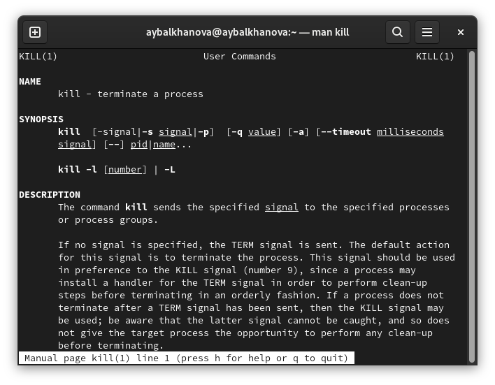{ #fig:009 width=70% }

	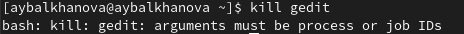{ #fig:010 width=70% }
	
1. Прочла справки команд df, du (рис. 0.11, 0.12). 

	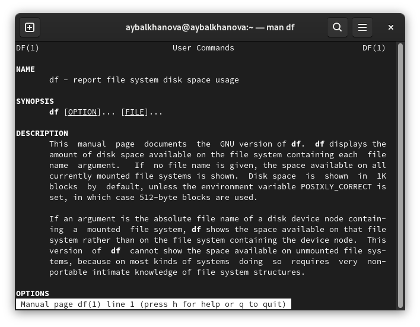{ #fig:011 width=70% }

	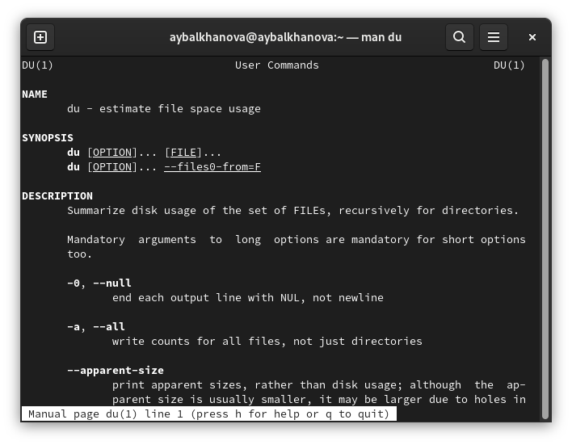{ #fig:012 width=70% }

1. Выполнила команды du -a ~/ для того, чтобы узнать число килобайт, используемое каждым файлом или каталогом (рис. 0.13). 

	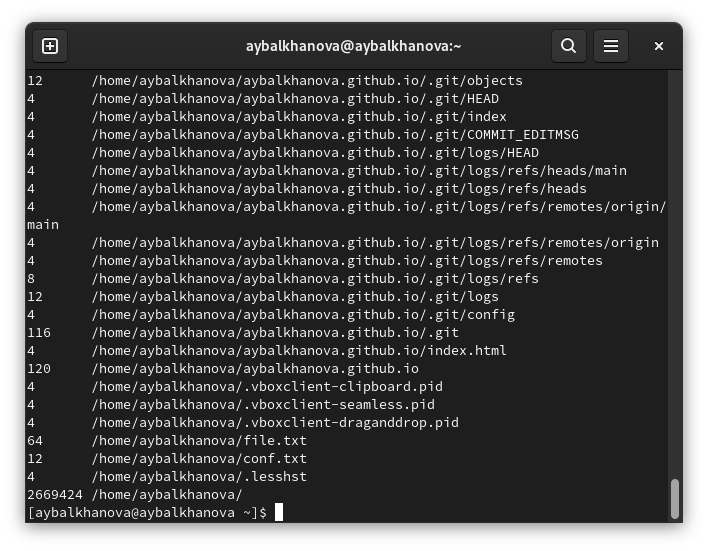{ #fig:013 width=70% }
	
1. Выполнила команды df -vi для того, чтобы узнать размер смонтированного раздела диска (рис. 0.14).

	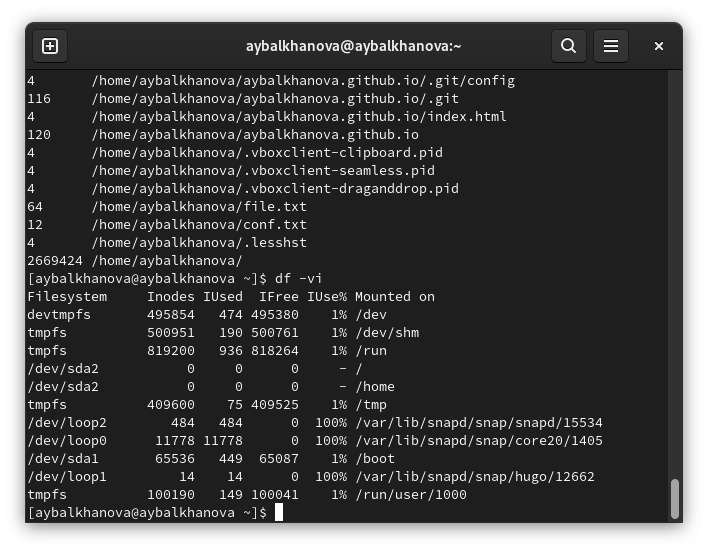{ #fig:014 width=70% }
	

1. Прочла справку команды find (рис. 0.15), вывела имена всех директорий, имеющихся в домашнем каталоге, используя команду find ~ -type d (рис. 0.16, 0.17).

	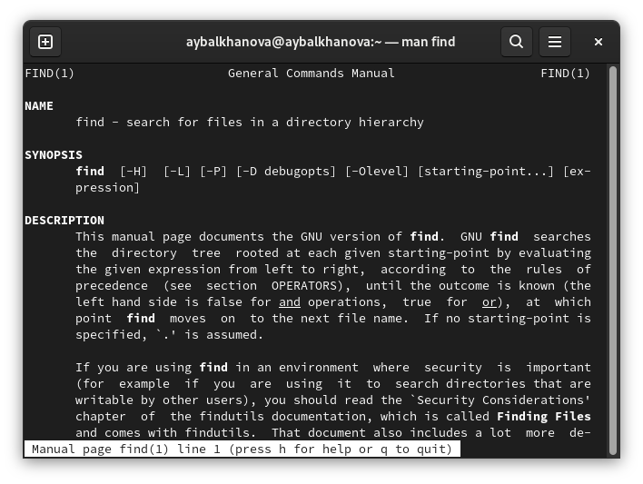{ #fig:015 width=70% }

	{ #fig:016 width=70% }
	
	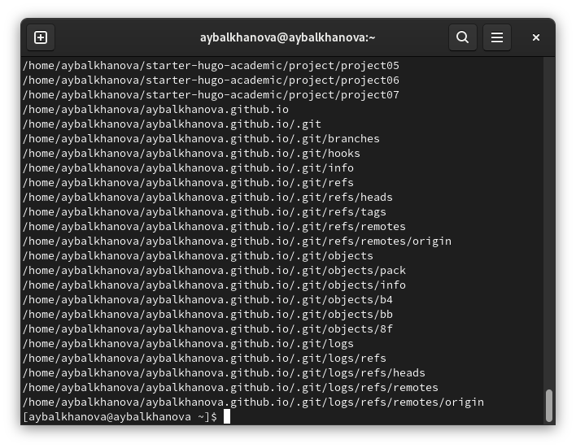{ #fig:016 width=70% }

# Контрольные вопросы
1. stdin — стандартный поток ввода; stdout — стандартный поток вывода; stderr — стандартный поток вывод сообщений об ошибках.
1. > перенаправит вывод в файл, а >> перенаправит вывод и откроет файл в режиме добавления.
1. Конвейер (pipe) служит для объединения простых команд или утилит в цепочки, в которых результат работы предыдущей команды передаётся последующей.
1. Компьютерная программа сама по себе — лишь пассивная последовательность инструкций. В то время как процесс — непосредственное выполнение этих инструкций.
1. Каждому процессу автоматически присваивается идентификационный номер уникального процесса (PID). GID– это идентификационный номер группы данного процесса.
1. Запущенные фоном программы называются задачами (jobs). Ими можно управлять с помощью команды jobs, которая выводит список запущенных в данный момент задач.
1. top - интерактивный просмотрщик процессов. htop аналог top. Программа top динамически выводит в режиме реального времени информации о работающей системе, т.е. о фактической активности процессов. Htop – основанный на ncurses просмотрщик процессов подобный top, htop, atop интерактивные просмоторщики процессов, но позволяющий прокручивать список процессов вертикально и горизонтально, чтобы видеть их полные параметры запуска. 
1. Команда поиска файлов ищет определённые файлы и каталоги. Командой find /etc -name "h*" -print  | less (рис. 0.5), я нашла файлы каталога /etc, начинающиеся с символа h.
1. Найти в текстовом файле указанную строку символов позволяет команда grep. grep lab lab.txt найдет в файле строку lab.
1. df -h
1. du ~/
1. Используя комакду kill.

# Выводы

Я ознакомилась с инструментами поиска файлов и фильтрации текстовых данных. Приобрела практические навыки по управлению процессами и заданиями, по проверке использования диска и обслуживанию файловых систем.

