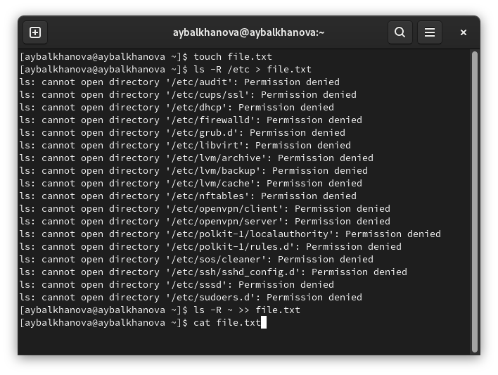
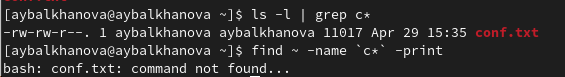
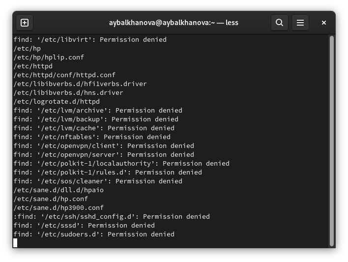
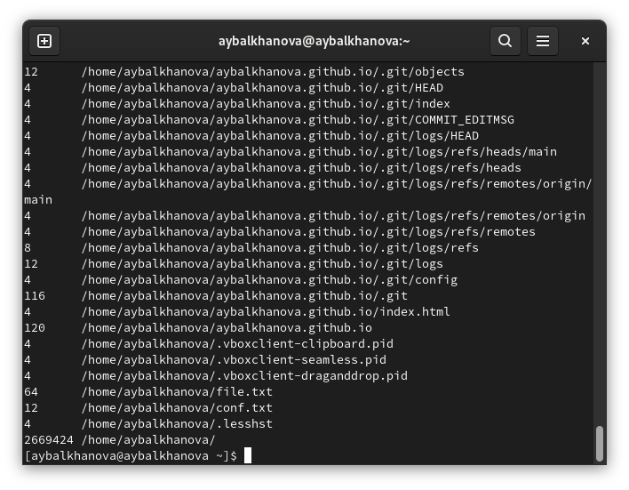
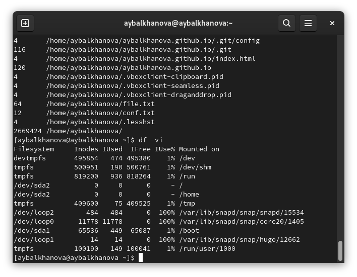

---
## Front matter
marp: true
lang: ru-RU
title: Презентация по лабораторной работе №6
author: |
	Балханова Алтана 
	НПМбд-03-21
institute: |
	\inst{1}RUDN University, Moscow, Russian Federation
date: NEC--2022, 28 April, 2022 Moscow, Russian Federation
## Formatting
toc: false
slide_level: 2
theme: metropolis
header-includes: 
 - \metroset{progressbar=frametitle,sectionpage=progressbar,numbering=fraction}
 - '\makeatletter'
 - '\beamer@ignorenonframefalse'
 - '\makeatother'
aspectratio: 43
section-titles: true
---

# Презентация по лабораторной работе №6
Балханова Алтана 
НПМбд-03-21
RUDN University, Moscow, Russian Federation
28 April, 2022 Moscow, Russian Federation

---
# Лабораторная работа №6

---

## Цель работы

Ознакомиться с инструментами поиска файлов и фильтрации текстовых данных. Приобрести практические навыки по управлению процессами и заданиями, по проверке использования диска и обслуживанию файловых систем.

---

## Запись файлов

---

## Поиск файлов

	
---

## Вывод нужных файлов

	

---

## Запуск в фоновом режиме редактора

---

## Число килобайт, используемое каждым файлом или каталогом, используя команду du

---

## Размер смонтированного раздела диска

	

---

## Вывод

Я ознакомилась с инструментами поиска файлов и фильтрации текстовых данных, так же я приобрела пркатические навыки по управлению процессами и заданиями, по проверке использования диска и обслуживанию файловых систем.

---

# Спасибо за внимание
