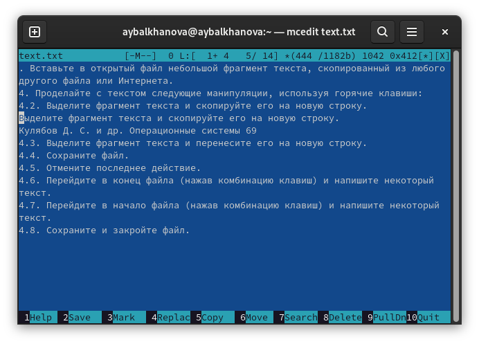

---
## Front matter
title: "Отчёт по лабораторной работе №7"
subtitle: "Операционные системы"
author: "Балханова Алтана Юрьевна"

## Generic otions
lang: ru-RU
toc-title: "Содержание"

## Bibliography
bibliography: bib/cite.bib
csl: pandoc/csl/gost-r-7-0-5-2008-numeric.csl

## Pdf output format
toc: true # Table of contents
toc-depth: 2
lof: true # List of figures
lot: true # List of tables
fontsize: 12pt
linestretch: 1.5
papersize: a4
documentclass: scrreprt
## I18n polyglossia
polyglossia-lang:
  name: russian
  options:
	- spelling=modern
	- babelshorthands=true
polyglossia-otherlangs:
  name: english
## I18n babel
babel-lang: russian
babel-otherlangs: english
## Fonts
mainfont: PT Serif
romanfont: PT Serif
sansfont: PT Sans
monofont: PT Mono
mainfontoptions: Ligatures=TeX
romanfontoptions: Ligatures=TeX
sansfontoptions: Ligatures=TeX,Scale=MatchLowercase
monofontoptions: Scale=MatchLowercase,Scale=0.9
## Biblatex
biblatex: true
biblio-style: "numeric"
biblatexoptions:
  - parentracker=true
  - backend=biber
  - hyperref=auto
  - language=auto
  - autolang=other*
  - citestyle=numeric
## Pandoc-crossref LaTeX customization
figureTitle: "Рис."
tableTitle: "Таблица"
listingTitle: "Листинг"
lofTitle: "Список иллюстраций"
lotTitle: "Список таблиц"
lolTitle: "Листинги"
## Misc options
indent: true
header-includes:
  - \usepackage{indentfirst}
  - \usepackage{float} # keep figures where there are in the text
  - \floatplacement{figure}{H} # keep figures where there are in the text
---

# Цель работы

Освоить основные возможности командной оболочки Midnight Commander. Приобрести навыки практической работы по просмотру каталогов и файлов; манипуляций с ними.

# Выполнение лабораторной работы

1. Задание по mc
	1. Изучила информацию о mc, вызвав в командной строке man mc (рис. 0.1).

		{ #fig:001 width=70% }

	1. Запустила из командной строки mc, изучила его структуру и меню (рис. 0.2, 0.3, 0.4, 0.5, 0.6, 0.7).

		{ #fig:002 width=70% }

		{ #fig:003 width=70% }

		{ #fig:004 width=70% }

		{ #fig:005 width=70% }

		{ #fig:006 width=70% }

		{ #fig:007 width=70% }

	1. Выполнила несколько операций в mc, используя управляющие клавиши (операции с панелями; выделение/отмена выделения файлов - ins (рис. 0.8), копирование файлов - F5 (рис. 0.9), перемещение файлов - F6 (рис. 0.10).

		{ #fig:008 width=70% }

		{ #fig:009 width=70% }

		{ #fig:010 width=70% }

	1. Получение информации о размере, выбрав формат списка (listing format) - стандартный(full) (рис. 0.11, 0.12), и правах доступа на файлы и каталоги, выбрав формат списка - расширенный(long) (рис. 0.13).

		{ #fig:011 width=70% }

		{ #fig:012 width=70% }

		{ #fig:013 width=70% }
		
	1. Выполнила основные команды меню левой панели (рис. 0.14).
		
		{ #fig:014 width=70% }
		
		Quick view – быстрый просмотр файлов из другой колонки. Info – Информация отекущем файле. Tree – Отображения каталогов в виде дерева. Sort order – порядок cортировки. Filter – фильтр отображаемых файлов. Encoding – выбирает кодировку. FTP, Shell, SMB link - эти режимы используются для отображения списка каталогов, располагающихся на удаленных компьютерах. Rescan – обновить панель.
			
	1. Используя возможности подменю Файл, выполнила:
		1. просмотр содержимого текстового файла - F3 (рис. 0.15).

			{ #fig:015 width=70% }
			
		1. редактирование содержимого текстового файла - F4 (рис. 0.16).

			{ #fig:016 width=70% }
			
		1. создание каталога 123 - F7 (рис. 0.17).

			{ #fig:017 width=70% }
			
		1. копирование файлов в созданный каталог - F5 (рис. 0.18, 0.19).

			{ #fig:018 width=70% }
			
			{ #fig:019 width=70% }
			
	1. С помощью соответствующих средств подменю Команда осуществила:
		1. поиск в файловой системе файла с заданными условиями (например, файла с расширением .c или .cpp, содержащего строку main)(рис. 0.20, 0.21, 0.22).

			{ #fig:020 width=70% }
					
			{ #fig:021 width=70% }
					
			{ #fig:022 width=70% }
		1. Нажала на историю (history) (рис. 0.23) и повторела последнюю команду -man mc (рис. 0.24, 0.25).

			{ #fig:023 width=70% }

			{ #fig:024 width=70% }

			{ #fig:025 width=70% }

		1. переход в домашний каталог (рис. 0.26).

			{ #fig:026 width=70% }
			
		1. анализ файла меню  - edit menu file (рис. 0.27, 0.28) и файла расширений - edit extension file (рис. 0.29, 0.30).

			{ #fig:027 width=70% }

			{ #fig:028 width=70% }

			{ #fig:029 width=70% }

			{ #fig:030 width=70% }

	1. Вызвала подменю Настройки. Освоила операции, определяющие структуру экрана mc (Full screen, Double Width, Show Hidden Files и т.д.) (рис. 0.31, 0.32).

		{ #fig:031 width=70% }

		{ #fig:032 width=70% }

1. Задание по встроенному редактору mc
	1. Создала текстовой файл text.txt, открыла его с помощью встроенного в mc редактора командой mcedit text.txt (рис. 0.33).

		{ #fig:033 width=70% }
		
	1. Вставила в открытый файл фрагмент текста (рис. 0.34).

		{ #fig:034 width=70% }
		
	1. Проделала с текстом следующие манипуляции, используя горячие клавиши:
		1. Удалила строку текста - F8 (рис. 0.35).

			{ #fig:035 width=70% }
			
		1. Выделила фрагмент текста - F3 и скопировала его на новую строку - F5 (рис. 0.36).

			{ #fig:036 width=70% }
			
		1. Выделила фрагмент текста - F3 и перенесла его на новую строку (рис. 0.37).

			{ #fig:037 width=70% }
			
		1. Сохранила файл - F2 (рис. 0.38).

			{ #fig:038 width=70% }
			
		1. Отменила последнее действие комбинацией клваиш ctrl-u.
		1. Перешла в конец файла комбинацией клавиш ctrl-end и написала текст (рис. 0.39).

			{ #fig:039 width=70% }
			
		1. Перешла в начало файла комбинацией клавиш ctrl-home и написала текст (рис. 0.40).

			{ #fig:040 width=70% }
			
		1. Сохранила и закрыла файл.
	1. Открыла файл с текстом с подсветкой синтаксиса (рис. 0.41).

		{ #fig:041 width=70% }
		
	1. Используя меню редактора, выключила подсветку синтаксиса (рис. 0.42, 0.43).

		{ #fig:042 width=70% }
		
		{ #fig:043 width=70% }
	
# Контрольные вопросы
1. Панели могут дополнительно быть переведены в один из двух режимов: Информация или Дерево. В режиме
Информация на панель выводятся сведения о файле и текущей файловой системе, расположенных на активной панели. В режиме Дерево на одной из панелей выводится структура дерева каталогов. Управлять режимами отображения панелей можно через пункты меню mc Правая панель и Левая панель.
1. Команда cat покажет содержимое файла так же, как и F3 позволит просмотреть содержимое файла без возможности редактирование. Команда cp скопирует нужные файлы в нужное место так же, как и клавиша F5.
1. Quick view – быстрый просмотр файлов из другой колонки. Info – Информация отекущем файле. Tree – Отображения каталогов в виде дерева. Sort order – порядок cортировки. Filter – фильтр отображаемых файлов. Encoding – выбирает кодировку. FTP, Shell, SMB link - эти режимы используются для отображения списка каталогов, располагающихся на удаленных компьютерах. Rescan – обновить панель.
1. Просмотр (F3) — позволяет посмотреть содержимое текущего (или выделенного) файла без возможности редактирования. Просмотр вывода команды ( М + ! ) — функция запроса команды с параметрами (аргумент к текущему выбранному файлу). Правка (F4) — открывает текущий (или выделенный) файл для его редактирования. Копирование (F5) — осуществляет копирование одного или нескольких файлов или каталогов в указанное пользователем во всплывающем окне место. Права доступа ( Ctrl-x c ) — позволяет указать (изменить) права доступа к одному или нескольким файлам или каталогам.
1. Дерево каталогов — отображает структуру каталогов системы. Поиск файла — выполняет поиск файлов по заданным параметрам. Жёсткая ссылка проявляется как реальный файл. После её создания невозможно определить, где сам файл, а где ссылка на него. Если удалить один из этих файлов, то другой останется целым. Символическая ссылка — ссылка (указатель) на имя файла-оригинала. Переставить панели — меняет местами левую и правую панели. Сравнить каталоги (Ctrl-x d) — сравнивает содержимое двух каталогов. Размеры каталогов — отображает размер и время изменения каталога (по умолчанию в mc размер каталога корректно не отображается). История командной строки — выводит на экран список ранее выполненных в оболочке команд. Каталоги быстрого доступа ( trl-\) — пр вызове выполняется быстрая смена текущего каталога на один из заданного списка. Восстановление файлов — позволяет восстановить файлы на файловых системах ext2 и ext3.Редактировать файл расширений — позволяет задать с помощью определённого синтаксиса действия при запуске файлов с определённым расширением (например, какое программного обеспечение запускать для открытия или редактирования файлов с расширением doc или docx). Редактировать файл меню — позволяет отредактировать контекстное меню пользователя, вызываемое по клавише F2 . Редактировать файл расцветки имён — позволяет подобрать оптимальную для пользователя расцветку имён файлов в зависимости от их типа.
1. Конфигурация — позволяет скорректировать настройки работы с панелями.Внешний вид и Настройки панелей — определяет элементы (строка меню, командная строка, подсказки и прочее), отображаемые при вызове mc, а также геометрию расположения панелей и цветовыделение. Биты символов — задаёт формат обработки информации локальным терминалом. Подтверждение — позволяет установить или убрать вывод окна с запросом подтверждения действий при операциях удаления и перезаписи файлов, а также при выходе из программы. Распознание клавиш — диалоговое окно используется для тестирования функциональных клавиш, клавиш управления курсором и прочее. Виртуальные ФС –– настройки виртуальной файловой системы: тайм-аут, пароль и прочее.
1. F1 Вызов контекстно-зависимой подсказки. F2 Вызов пользовательского меню с возможностью создания и/или дополнения дополнительных функций. F3 Просмотр содержимого файла, на который указывает подсветка в активной панели (без возможности редактирования). F4 Вызов встроенного в mc редактора для изменения содержания файла, на который указывает подсветка в активной панели. F5 Копирование одного или нескольких файлов, отмеченных в первой (активной) панели, в каталог, отображаемый на второй панели. F6 Перенос одного или нескольких файлов, отмеченных в первой (активной) панели, в каталог, отображаемый на второй панели. F7 Создание подкаталога в каталоге, отображаемом в активной панели. F8 Удаление одного или нескольких файлов (каталогов), отмеченных в первой (активной) панели файлов. F9 Вызов меню mc. F10 Выход из mc. 
1. Ctrl-y удалить строку. Ctrl-u отмена последней операции. Ins вставка/замена. F7 поиск (можно использовать регулярные выражения). Вверх + F7 повтор последней операции поиска. F4 замена. F3 первое нажатие — начало выделения, второе — окончание выделения. F5 копировать выделенный фрагмент. F6 переместить выделенный фрагмент. F8 удалить выделенный фрагмент. F2 записать изменения в файл. F10 выйти из редактора. 
1. Формат списка - определённый пользователем — позволяет вывести те сведения о файле или каталоге, которые задаст сам пользователь.
1. Правка (F4) — открывает текущий (или выделенный) файл для его редактирования.

# Выводы
Я освоила основные возможности командной оболочки Midnight Commander. Приобрела навыки практической работы по просмотру каталогов и файлов; манипуляций с ними.

