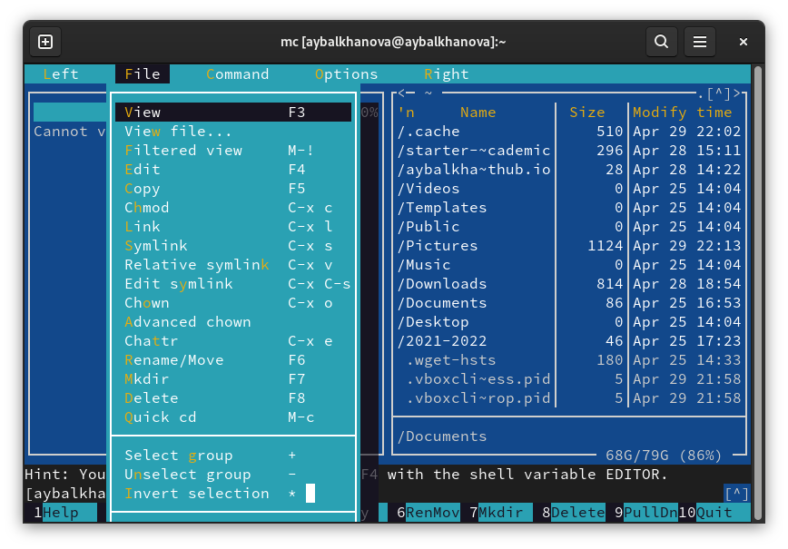
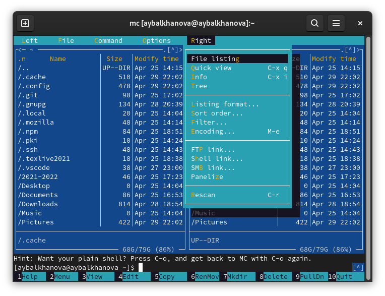
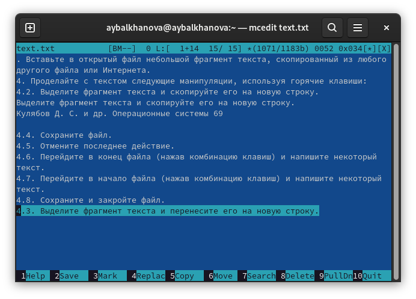

---
## Front matter
marp: true
lang: ru-RU
title: Презентация по лабораторной работе №7
author: |
	Балханова Алтана 
	НПМбд-03-21
institute: |
	\inst{1}RUDN University, Moscow, Russian Federation
date: NEC--2022, 28 April, 2022 Moscow, Russian Federation
## Formatting
toc: false
slide_level: 2
theme: metropolis
header-includes: 
 - \metroset{progressbar=frametitle,sectionpage=progressbar,numbering=fraction}
 - '\makeatletter'
 - '\beamer@ignorenonframefalse'
 - '\makeatother'
aspectratio: 43
section-titles: true
---

# Презентация по лабораторной работе №7
Балханова Алтана 
НПМбд-03-21
RUDN University, Moscow, Russian Federation
28 April, 2022 Moscow, Russian Federation

---

# Лабораторная работа №7

---

## Цель работы

Освоить основные возможности командной оболочки Midnight Commander. Приобрести навыки практической работы по просмотру каталогов и файлов; манипуляций с ними.

---

## Структура mc

---

## Левая панель

---

## Файл

---

## Команда

---

## Опции

---

## Правая панель

 

---
## Удаление строки текста - F8.

---
## Выделение фрагмента текста - F3, копирование и его вставка на новую строку - F5 
	

			
---

## Выделение фрагмента текста - F3 и его перенос на новую строку.

---

## Вывод

Я освоила основные возможности командной оболочки Midnight Commander. Приобрела навыки практической работы по просмотру каталогов и файлов; манипуляций с ними.

---

# Спасибо за внимание
