---
## Front matter
title: "Отчёт по лабораторной работе №8"
subtitle: "Операционные системы"
author: "Балханова Алтана Юрьевна"

## Generic otions
lang: ru-RU
toc-title: "Содержание"

## Bibliography
bibliography: bib/cite.bib
csl: pandoc/csl/gost-r-7-0-5-2008-numeric.csl

## Pdf output format
toc: true # Table of contents
toc-depth: 2
lof: true # List of figures
lot: true # List of tables
fontsize: 12pt
linestretch: 1.5
papersize: a4
documentclass: scrreprt
## I18n polyglossia
polyglossia-lang:
  name: russian
  options:
	- spelling=modern
	- babelshorthands=true
polyglossia-otherlangs:
  name: english
## I18n babel
babel-lang: russian
babel-otherlangs: english
## Fonts
mainfont: PT Serif
romanfont: PT Serif
sansfont: PT Sans
monofont: PT Mono
mainfontoptions: Ligatures=TeX
romanfontoptions: Ligatures=TeX
sansfontoptions: Ligatures=TeX,Scale=MatchLowercase
monofontoptions: Scale=MatchLowercase,Scale=0.9
## Biblatex
biblatex: true
biblio-style: "numeric"
biblatexoptions:
  - parentracker=true
  - backend=biber
  - hyperref=auto
  - language=auto
  - autolang=other*
  - citestyle=numeric
## Pandoc-crossref LaTeX customization
figureTitle: "Рис."
tableTitle: "Таблица"
listingTitle: "Листинг"
lofTitle: "Список иллюстраций"
lotTitle: "Список таблиц"
lolTitle: "Листинги"
## Misc options
indent: true
header-includes:
  - \usepackage{indentfirst}
  - \usepackage{float} # keep figures where there are in the text
  - \floatplacement{figure}{H} # keep figures where there are in the text
---

# Цель работы

Познакомиться с операционной системой Linux. Получить практические навыки работы с редактором vi, установленным по умолчанию практически во всех дистрибутивах.

# Выполнение лабораторной работы
1. 
	1. Создала каталог с именем ~/work/os/lab06 и перешла в него. Вызвала vi и создайте файл hello.sh командой vi hello.sh (рис. 0.1, 0.2).

		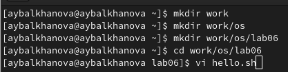{ #fig:001 width=70% }

		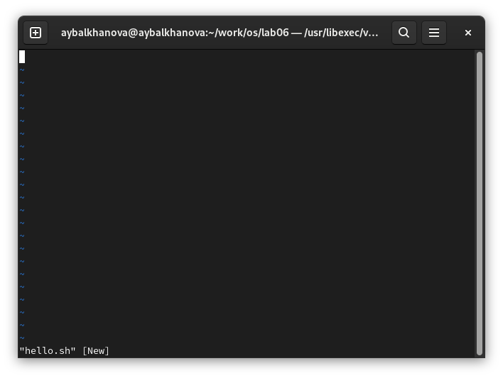{ #fig:002 width=70% }
		
	1. Нажала клавишу i, чтобы ввести текст (рис. 0.3).

		{ #fig:003 width=70% }
		
	1. Нажала клавишу Esc, чтобы перейти в командный режим (рис. 0.4).

		{ #fig:004 width=70% }

	1. Нажала для перехода в режим последней строки и нажала wq, чтобы записать и выйти (рис. 0.5).

		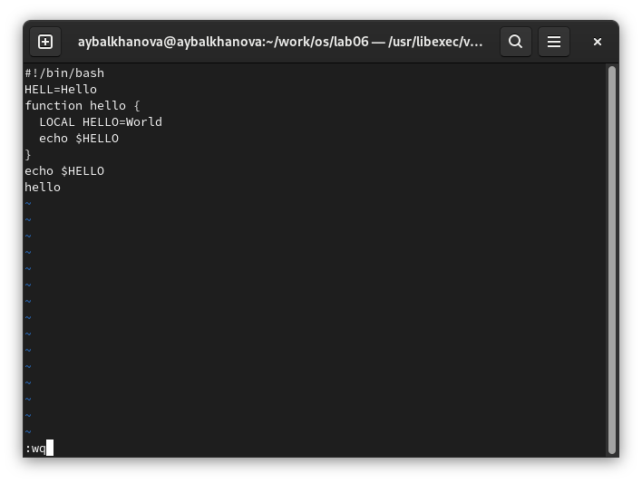{ #fig:005 width=70% }

	1. Сделала файл исполняемым командой chmod +x hello.sh (рис. 0.6).

		{ #fig:006 width=70% }
		
1. 
	1. Вызовала vi на редактирование файла hello.sh (рис. 0.7).

		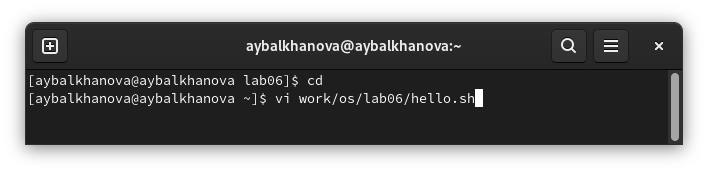{ #fig:007 width=70% }

	1. Установила курсор в конец слова HELL второй строки (рис. 0.8).

		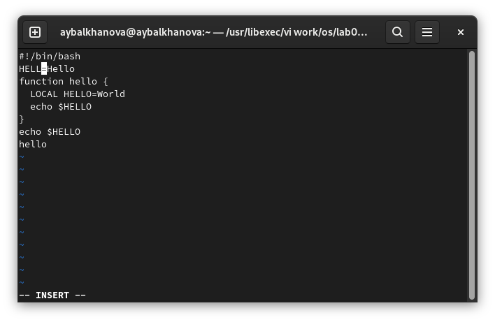{ #fig:008 width=70% }
		
	1. Перешла в режим вставки, нажав на i и добавила О. Нажала Esc для возврата в командный режим (рис. 0.9).

		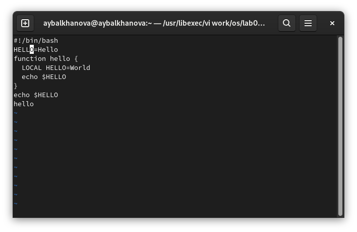{ #fig:009 width=70% }

	1. Установила курсор на четвертую строку, стёрла слово LOCAL, используя клавиши dw, и перейдя в режим вставки, набрала слово local, после чего веррнулась в командный режим (рис. 0.10).

		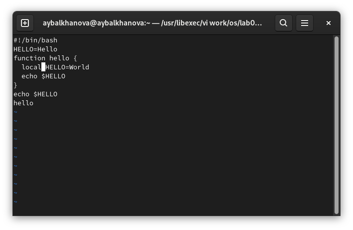{ #fig:010 width=70% }

	1. Установила курсор на строке со словами echo $HELLO, нажала 1Y для того, чтобы скопировать одну строку. Затем установила курсов на последней строке файла. Вставила после неё строку, используя p (рис. 0.11).

		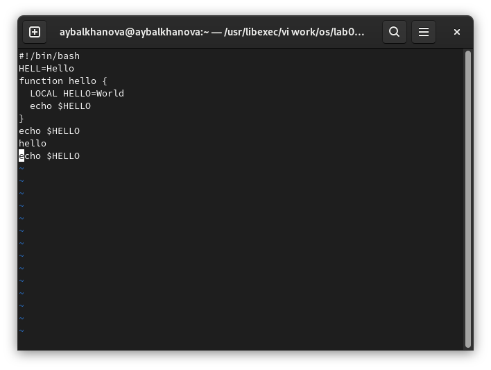{ #fig:011 width=70% }

	1. Удалила последнюю строку, используя клавиши dd (рис. 0.12).

		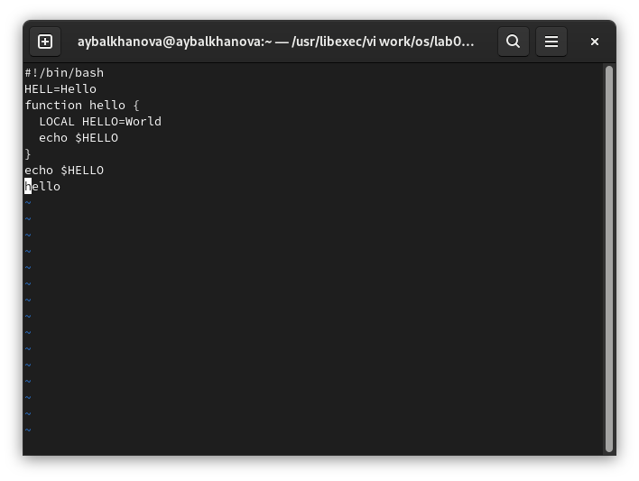{ #fig:012 width=70% }

	1. Ввела команду отмены изменений u для отмены последней команды (рис. 0.13).

		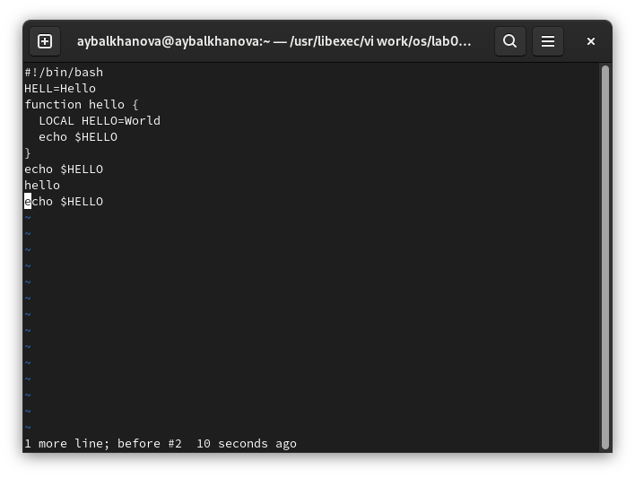{ #fig:013 width=70% }

	1. Ввела символ : для перехода в режим последней строки. Записала произведённые изменения и вышла из vi, введя wq (рис. 0.14).

		{ #fig:014 width=70% }
	
# Контрольные вопросы
1. 
	– командный режим — предназначен для ввода команд редактирования и навигации по редактируемому файлу;
	– режим вставки — предназначен для ввода содержания редактируемого файла;
	– режим последней (или командной) строки — используется для записи изменений в файл и выхода из редактора.
1. : q ! — выйти из редактора без записи;
1. 
	– 0 — переход в начало строки;
	– $ — переход в конец строки;
	– G — переход в конец файла;
	– nG — переход на строку с номером n.
1. При использовании прописных W и B под разделителями понимаются только пробел, табуляция и возврат каретки. При использовании строчных w и b под разделителями понимаются также любые знаки пунктуации.
1. 
	– G — переход в конец файла;
	– 1G — переход в начало файла.
1. 
	- Вставка текста
		– а — вставить текст после курсора;
		– А — вставить текст в конец строки;
		– i — вставить текст перед курсором;
		– ni — вставить текст n раз;
		– I — вставить текст в начало строки.
	- Вставка строки
		– о — вставить строку под курсором;
		– О — вставить строку над курсором.
	- Удаление текста
		– x — удалить один символ в буфер;
		– d w — удалить одно слово в буфер;
		– d $ — удалить в буфер текст от курсора до конца строки;
		– d 0 — удалить в буфер текст от начала строки до позиции курсора;
		– d d — удалить в буфер одну строку;
		– n d d — удалить в буфер n строк.
	- Отмена и повтор произведённых изменений
		– u — отменить последнее изменение;
		– . — повторить последнее изменение.
	- Копирование текста в буфер
		– Y — скопировать строку в буфер;
		– n Y — скопировать n строк в буфер;
		– y w — скопировать слово в буфер.
	- Вставка текста из буфера
		– p — вставить текст из буфера после курсора;
		– P — вставить текст из буфера перед курсором.
	- Замена текста
		– c w — заменить слово;
		– n c w — заменить n слов;
		– c $ — заменить текст от курсора до конца строки;
		– r — заменить слово;
		– R — заменить текст.
	- Поиск текста
		– / текст — произвести поиск вперёд по тексту указанной строки символов текст;
		– ? текст — произвести поиск назад по тексту указанной строки символов текст.
1. Нажать 0, нажать с$ — заменить текст от курсора до конца строки.
1. u — отменить последнее изменение.
1. 
	- Копирование и перемещение текста
		– : n,m d — удалить строки с n по m;
		– : i,j m k — переместить строки с i по j, начиная со строки k;
		– : i,j t k — копировать строки с i по j в строку k;
		– : i,j w имя-файла — записать строки с i по j в файл с именем имя-файла.
	- Запись в файл и выход из редактора
		– : w — записать изменённый текст в файл, не выходя из vi;
		– : w имя-файла — записать изменённый текст в новый файл с именем имя-файла;
		– : w ! имя-файла — записать изменённый текст в файл с именем имя-файла;
		– : w q — записать изменения в файл и выйти из vi;
		– : q — выйти из редактора vi;
		– : q ! — выйти из редактора без записи;
		– : e ! — вернуться в командный режим, отменив все изменения, произведённые со времени последней записи.
	- Опции
		– : set all — вывести полный список опций;
		– : set nu — вывести номера строк;
		– : set list — вывести невидимые символы;
		– : set ic — не учитывать при поиске, является ли символ прописным или строчным.
1. Нужно нажать на $ и посмотреть на число в углу экрана.
1. : set all — вывести полный список опций (рис. 0.1).

	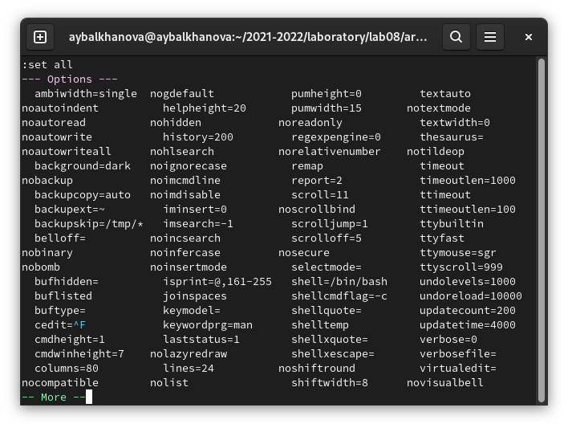{ #fig:001 width=70% }
	
1. Внизу экрана написано режим вставки, в командном режиме ничего нет, а в режиме поледней строки видно введённое двоеточие и ввод осуществляется только на последней выделенной строке.
1. 
Командный режим -> ***i*** -> режим вставки -> ***Esc*** -> Командный режим
Командный режим -> ***:*** -> Режим последней строки -> ***Enter*** -> Командный режим

# Выводы

Я познакомилась с операционной системой Linux. Получила практические навыки работы с редактором vi, установленным по умолчанию практически во всех дистрибутивах.

