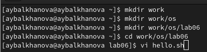
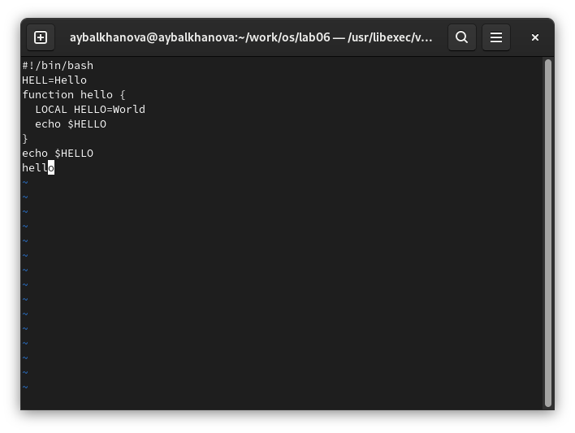
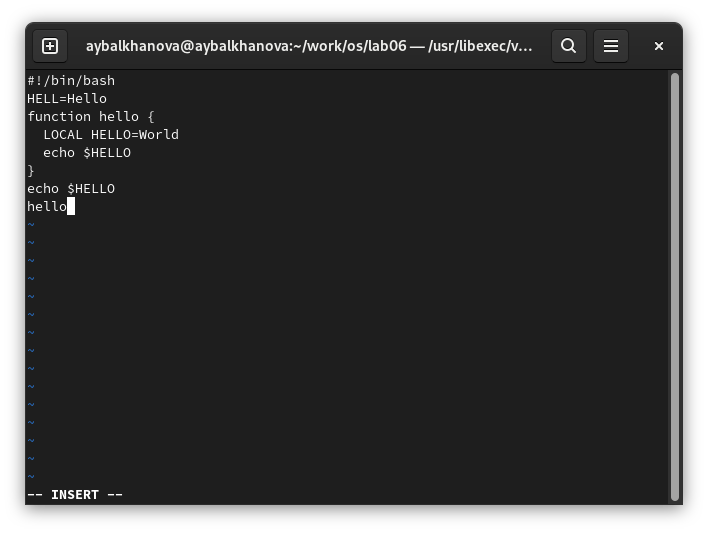
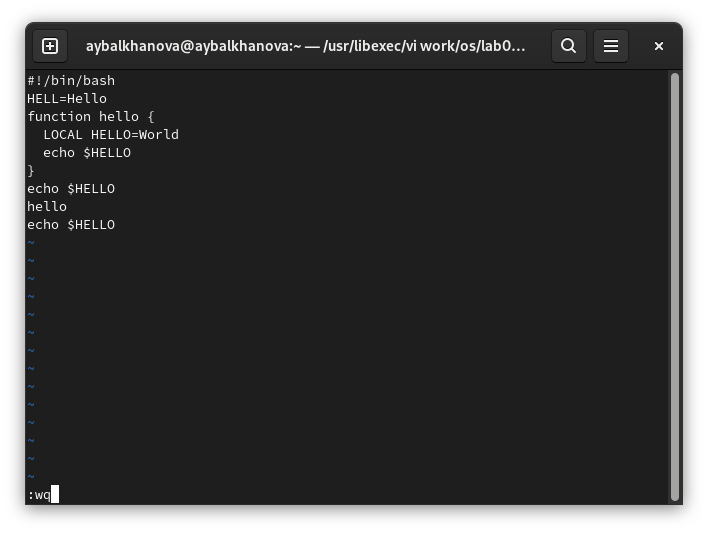

---
## Front matter
marp: true
lang: ru-RU
title: Презентация по лабораторной работе №8
author: |
	Балханова Алтана 
	НПМбд-03-21
institute: |
	\inst{1}RUDN University, Moscow, Russian Federation
date: NEC--2022, 28 April, 2022 Moscow, Russian Federation
## Formatting
toc: false
slide_level: 2
theme: metropolis
header-includes: 
 - \metroset{progressbar=frametitle,sectionpage=progressbar,numbering=fraction}
 - '\makeatletter'
 - '\beamer@ignorenonframefalse'
 - '\makeatother'
aspectratio: 43
section-titles: true
---

# Презентация по лабораторной работе №8
Балханова Алтана 
НПМбд-03-21
RUDN University, Moscow, Russian Federation
28 April, 2022 Moscow, Russian Federation

---

# Лабораторная работа №8

---

## Цель работы

Познакомиться с операционной системой Linux. Получить практические навыки работы с редактором vi, установленным по умолчанию практически во всех дистрибутивах.

---

## Вызов vi

---
## Клавиша Esc возвращает в командный режим

---
## Клавиша i возвращает в режим вставки

---
## Сохранение и выход (wq)

---
## Вывод

Я познакомилась с операционной системой Linux. Получила практические навыки работы с редактором vi.

---

# Спасибо за внимание
