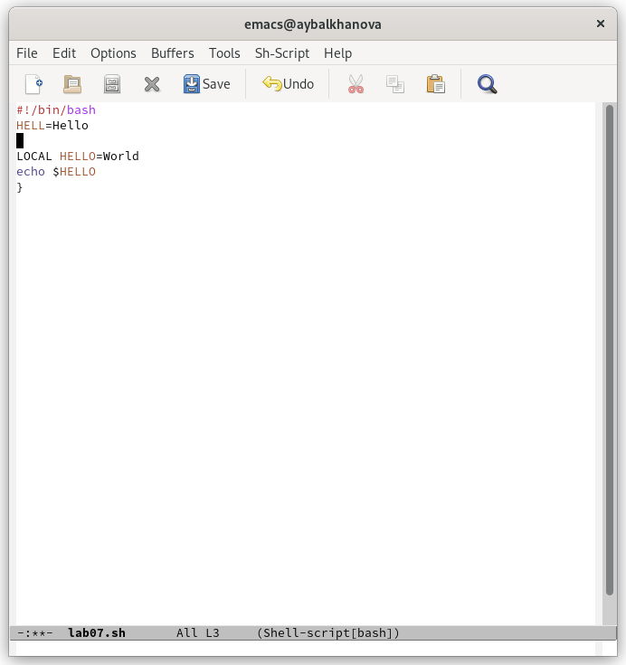
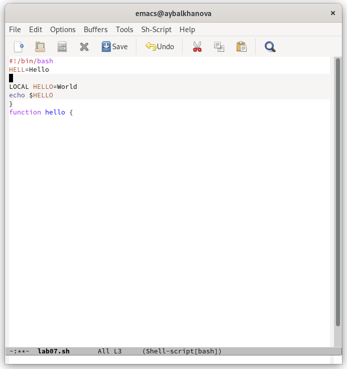
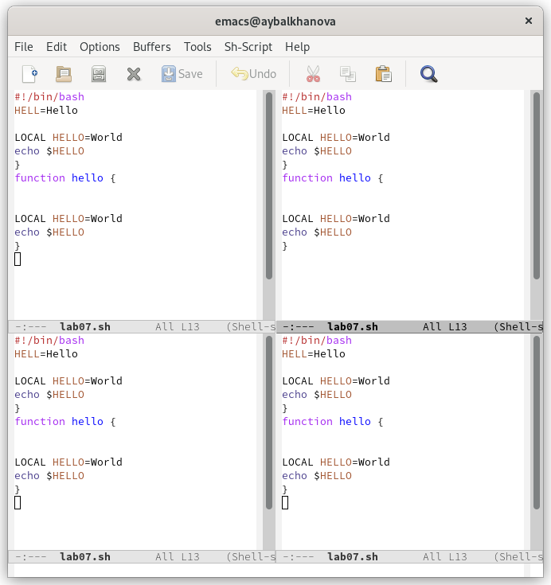

---
## Front matter
title: "Отчёт по лабораторной работе №9"
subtitle: "Операционные системы"
author: "Балханова Алтана Юрьевна"

## Generic otions
lang: ru-RU
toc-title: "Содержание"

## Bibliography
bibliography: bib/cite.bib
csl: pandoc/csl/gost-r-7-0-5-2008-numeric.csl

## Pdf output format
toc: true # Table of contents
toc-depth: 2
lof: true # List of figures
lot: true # List of tables
fontsize: 12pt
linestretch: 1.5
papersize: a4
documentclass: scrreprt
## I18n polyglossia
polyglossia-lang:
  name: russian
  options:
	- spelling=modern
	- babelshorthands=true
polyglossia-otherlangs:
  name: english
## I18n babel
babel-lang: russian
babel-otherlangs: english
## Fonts
mainfont: PT Serif
romanfont: PT Serif
sansfont: PT Sans
monofont: PT Mono
mainfontoptions: Ligatures=TeX
romanfontoptions: Ligatures=TeX
sansfontoptions: Ligatures=TeX,Scale=MatchLowercase
monofontoptions: Scale=MatchLowercase,Scale=0.9
## Biblatex
biblatex: true
biblio-style: "numeric"
biblatexoptions:
  - parentracker=true
  - backend=biber
  - hyperref=auto
  - language=auto
  - autolang=other*
  - citestyle=numeric
## Pandoc-crossref LaTeX customization
figureTitle: "Рис."
tableTitle: "Таблица"
listingTitle: "Листинг"
lofTitle: "Список иллюстраций"
lotTitle: "Список таблиц"
lolTitle: "Листинги"
## Misc options
indent: true
header-includes:
  - \usepackage{indentfirst}
  - \usepackage{float} # keep figures where there are in the text
  - \floatplacement{figure}{H} # keep figures where there are in the text
---

# Цель работы

Познакомиться с операционной системой Linux. Получить практические навыки работы с редактором Emacs.

# Выполнение лабораторной работы
1. Открыла emacs с помощью комнады emacs &.
1. Создала файл lab07.sh с помощью комбинации C-x C-f (рис. 0.1).

	{ #fig:001 width=70% }

1. Набрала текст (рис. 0.2) и сохранила его, используя комбинацию клавиш (C-x C-s).

	{ #fig:001 width=70% }

1. Проделала с текстом стандартные процедуры редактирования.
	1. Вырезала одной командой целую строку (С-k) (рис. 0.3).

		{ #fig:001 width=70% }

	1. Вставила эту строку в конец файла (C-y) (рис. 0.4).

		{ #fig:001 width=70% }

	1. Выделила область текста (C-space) (рис. 0.5). Скопировала область в буфер обмена (M-w).

		{ #fig:001 width=70% }

	1. Вставила область в конец файла, используя С-y (рис. 0.6).

		{ #fig:001 width=70% }

	1. Вновь выделила эту область (C-space) и на этот раз вырезать её (C-w) (рис. 0.7).

		{ #fig:001 width=70% }

	1. Отменила последнее действие (C-/) (рис. 0.8.).

		{ #fig:001 width=70% }

1. Научилась использовать команды по перемещению курсора.
	1. Переместила курсор в начало строки (C-a) (рис. 0.9).

		{ #fig:001 width=70% }
		
	1. Переместила курсор в конец строки (C-e) (рис. 0.10).

		{ #fig:001 width=70% }
		
	1. Переместила курсор в начало буфера (M-<) (рис. 0.11).

		{ #fig:001 width=70% }
		
	1. Переместила курсор в конец буфера (M->) (рис. 0.12).

		{ #fig:001 width=70% }

1. Управление буферами.
	1. Вывела список активных буферов на экран (C-x C-b) (рис. 0.13).

		{ #fig:001 width=70% }
		
	1. Переместилась во вновь открытое окно (C-x o) со списком открытых буферов и переключилась на другой буфер (рис. 0.14).

		{ #fig:001 width=70% }
		
	1. Закрыла это окно (C-x 0) (рис. 0.15).

		{ #fig:001 width=70% }
		
	1. Переключайтесь между буферами, но уже без вывода их списка на экран (C-x b) (рис. 0.16, 0.17).

		{ #fig:001 width=70% }
		
		{ #fig:001 width=70% }

1. Управление окнами.
	1. Поделила фрейм на 4 части: разделила фрейм на два окна по вертикали (C-x 3) (рис.0.18), а затем каждое из этих окон на две части по горизонтали (C-x 2) (рис. 0.19).

		{ #fig:001 width=70% }
		
		{ #fig:001 width=70% }
			
	1. В каждом из четырёх созданных окон откройте новый буфер (файл) и введите
	несколько строк текста (рис. 0.20, 0.21).

		{ #fig:001 width=70% }
		
		{ #fig:001 width=70% }

1. Режим поиска
	1. Переключилась в режим поиска (C-s) и нашла несколько слов, присутствующих в тексте (рис. 0.22).

		{ #fig:001 width=70% }
			
	1. Переключалась между результатами поиска, нажимая C-s (рис. 0.23).

		{ #fig:001 width=70% }
			
	1. Вышла из режима поиска, нажав C-g (рис. 0.24).

		{ #fig:001 width=70% }
			
	1. Перешла в режим поиска и замены (M-%), ввела текст, который следует найти и заменить (рис. 0.25), нажала Enter, затем ввела текст для замены(рис. 0.26). После того как подсветились результаты поиска, нажала ! для подтверждения замены (рис. 0.27).

		{ #fig:001 width=70% }
		
		{ #fig:001 width=70% }
		
		{ #fig:001 width=70% }
		
	1. Попробовала другой режим поиска, нажав M-s o (рис. 0.28, 0.29). В отличие от обычного режима поиска он выводит чтроки с найденными результатами в отдельном буфере.

		{ #fig:001 width=70% }

		{ #fig:001 width=70% }

# Контрольные вопросы
1. Emacs — семейство многофункциональных расширяемых текстовых редакторов. Emacs представляет собой мощный экранный редактор текста, написанный на языке высокого уровня Elisp.
1. Большое количество различных комбинаций клавиш, которые исопльзуются для работы с ним.
1. Буфер — объект, представляющий какой-либо текст. Окно — область фрейма, отображающая один из буферов.
1. Можно открыть более 10 буферов.
1. Только что запущенный Emacs несет один буфер с именем `*scratch*', который может быть использован для вычисления выражений Лиспа в Emacs.
1. Зажимая ctrl, нажимаю на с, после чего нажимаю на |. Зажимая ctrl, нажимаю на с, после чего, зажимая ctrl, нажимаю на |.
1. Сtrl-x 3 или сtrl-x 2.
1. В файле .emacs
1. Эта клавиша удаляет символы, её можно переназначить.
1. Emacs показался мне более удобным из-за удобного интерфейса.

# Выводы

Я познакомилась с операционной системой Linux и получила практические навыки работы с редактором Emacs.
