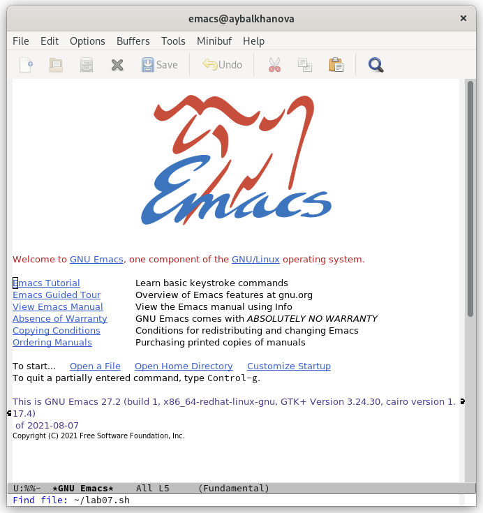
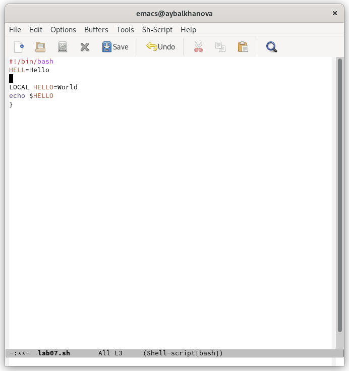
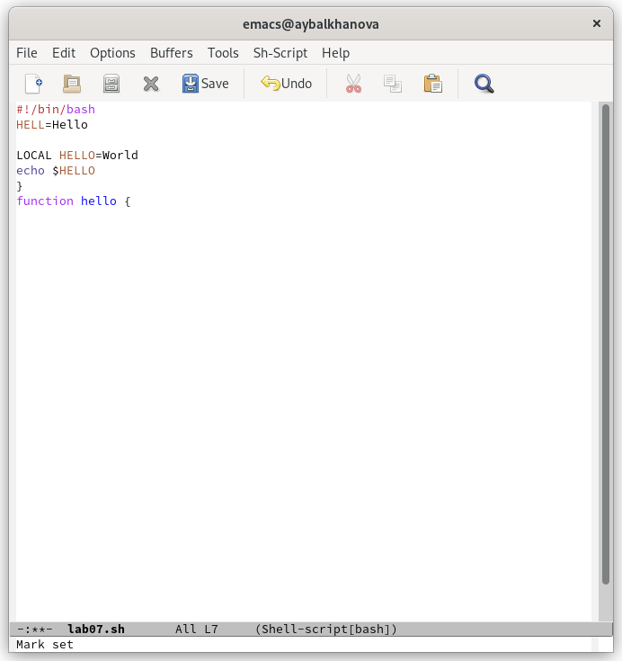
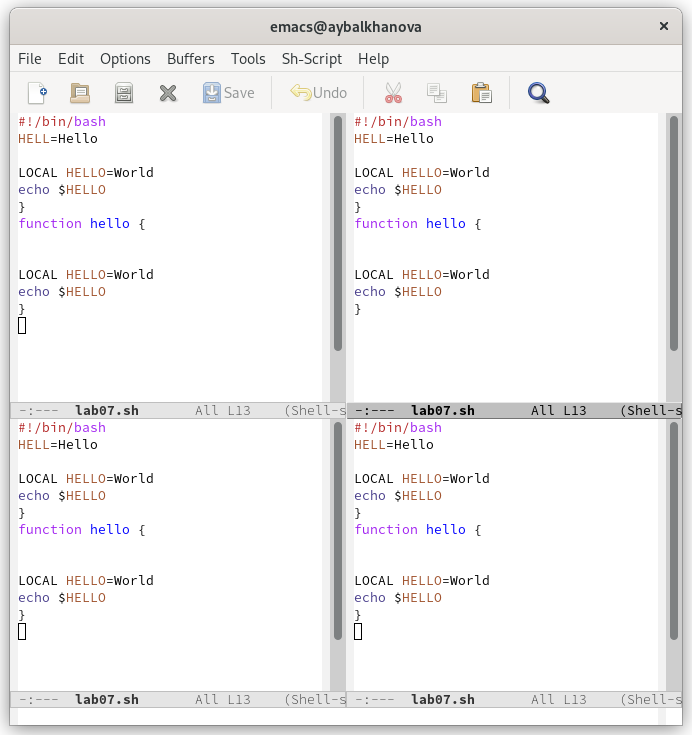
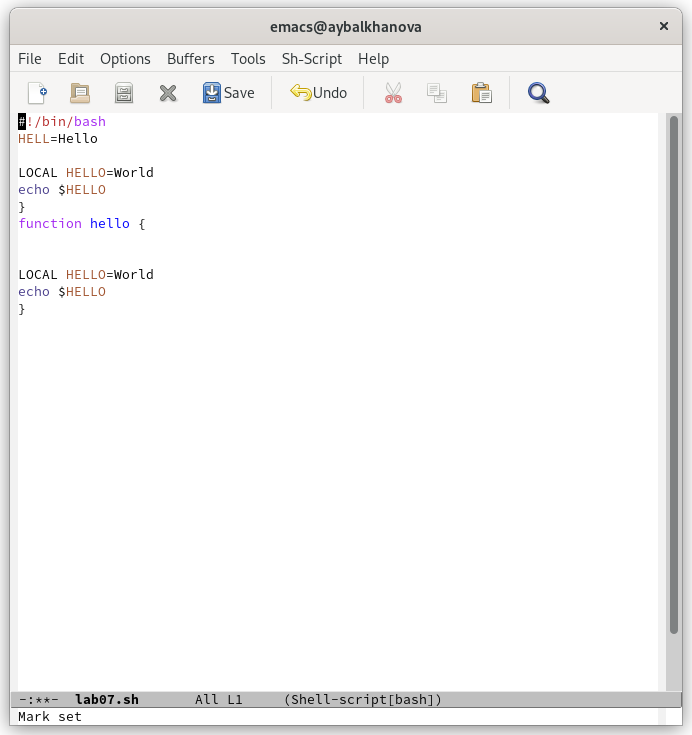

---
## Front matter
marp: true
lang: ru-RU
title: Презентация по лабораторной работе №9
author: |
	Балханова Алтана 
	НПМбд-03-21
institute: |
	\inst{1}RUDN University, Moscow, Russian Federation
date: NEC--2022, 28 April, 2022 Moscow, Russian Federation
## Formatting
toc: false
slide_level: 2
theme: metropolis
header-includes: 
 - \metroset{progressbar=frametitle,sectionpage=progressbar,numbering=fraction}
 - '\makeatletter'
 - '\beamer@ignorenonframefalse'
 - '\makeatother'
aspectratio: 43
section-titles: true
---

# Презентация по лабораторной работе №9
Балханова Алтана 
НПМбд-03-21
RUDN University, Moscow, Russian Federation
28 April, 2022 Moscow, Russian Federation

---

# Лабораторная работа №9

---

## Цель работы

Познакомиться с операционной системой Linux. Получить практические навыки работы с редактором Emacs.

---

## Emacs

Я научилась работать с редактором emcacs.

---

## Проделала с текстом стандартные процедуры редактирования

Вырезала одной командой целую строку (С-k) и вставила её (C-y).

---

---

## Научилась делить экран на несколько частей

---

## Научилась перемещать курсор, используя комбинации клавиш

Переместила курсор в начало буфера (M-<).

---

## Вывод

Я познакомилась с операционной системой Linux и получила практические навыки работы с редактором Emacs.

---

# Спасибо за внимание
