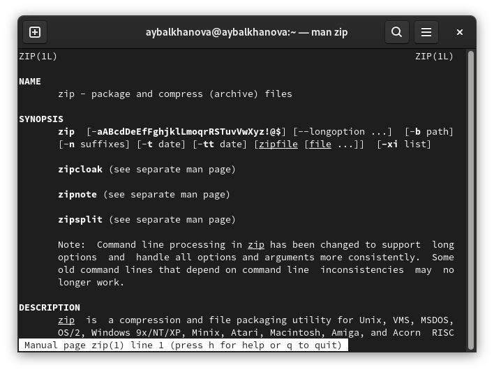
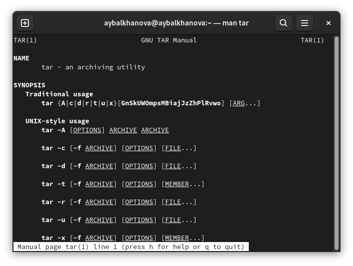
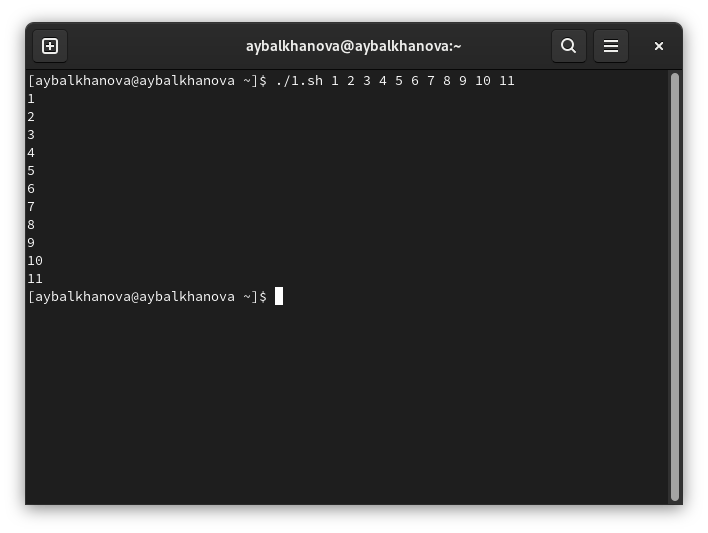
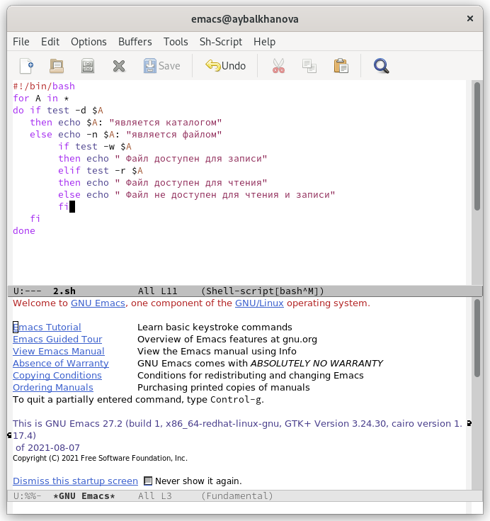

---
## Front matter
title: "Отчёт по лабораторной работе №10"
subtitle: "Операционные системы"
author: "Балханова Алтана Юрьевна"

## Generic otions
lang: ru-RU
toc-title: "Содержание"

## Bibliography
bibliography: bib/cite.bib
csl: pandoc/csl/gost-r-7-0-5-2008-numeric.csl

## Pdf output format
toc: true # Table of contents
toc-depth: 2
lof: true # List of figures
lot: true # List of tables
fontsize: 12pt
linestretch: 1.5
papersize: a4
documentclass: scrreprt
## I18n polyglossia
polyglossia-lang:
  name: russian
  options:
	- spelling=modern
	- babelshorthands=true
polyglossia-otherlangs:
  name: english
## I18n babel
babel-lang: russian
babel-otherlangs: english
## Fonts
mainfont: PT Serif
romanfont: PT Serif
sansfont: PT Sans
monofont: PT Mono
mainfontoptions: Ligatures=TeX
romanfontoptions: Ligatures=TeX
sansfontoptions: Ligatures=TeX,Scale=MatchLowercase
monofontoptions: Scale=MatchLowercase,Scale=0.9
## Biblatex
biblatex: true
biblio-style: "numeric"
biblatexoptions:
  - parentracker=true
  - backend=biber
  - hyperref=auto
  - language=auto
  - autolang=other*
  - citestyle=numeric
## Pandoc-crossref LaTeX customization
figureTitle: "Рис."
tableTitle: "Таблица"
listingTitle: "Листинг"
lofTitle: "Список иллюстраций"
lotTitle: "Список таблиц"
lolTitle: "Листинги"
## Misc options
indent: true
header-includes:
  - \usepackage{indentfirst}
  - \usepackage{float} # keep figures where there are in the text
  - \floatplacement{figure}{H} # keep figures where there are in the text
---

# Цель работы

Изучить основы программирования в оболочке ОС UNIX/Linux. Научиться писать небольшие командные файлы.

# Выполнение лабораторной работы
1. Создала файл backup.sh, исопльзуя комбинации клафиш С-x C-f (рис. 0.1). 

	{ #fig:001 width=70% }

1. Прочитала справки архиваторов zip, bzip2, tar (рис. 0.2, 0.3, 0.4).

	{ #fig:001 width=70% }

	{ #fig:001 width=70% }

	{ #fig:001 width=70% }

1. Написала скрипт, который делает резервную копию самого себя и отправляет его в директорию backup (рис. 0.5).

	{ #fig:001 width=70% }

1. Дала разрешение на выполнение с помощью команды chmod +x backup.sh и проверила работу скрипта, используя команду ./backup.sh (рисю 0.6).

	{ #fig:001 width=70% }

1. Написала командный файл, печатающий более 10 аргументов, передаваемых по командной строке (рис. 0.7).

	{ #fig:001 width=70% }
	
1. Проверила его работу (рис. 0.8).

	{ #fig:001 width=70% }

1. Написаал командный файл - аналог команды ls (рис. 0.9).

	{ #fig:001 width=70% }
	
1. Проверила его работу ./2.sh (рис. 0.10).

	{ #fig:001 width=70% }

1. Написала командный файл, который считает количество файлов с заданным расширением в заданном каталоге (рис. 0.11).

	{ #fig:001 width=70% }
	
1. Проверила его работу './3.sh ~ .txt' и './3.sh ~ .doc' (рис. 0.12).

	{ #fig:001 width=70% }

# Контрольные вопросы
1. Командная оболочка Unix — командный интерпретатор, используемый в операционных системах семейства Unix, в котором пользователь может либо давать команды операционной системе по отдельности, либо запускать скрипты, состоящие из списка команд.
1. POSIX (Portable Operating System Interface for Computer Environments) — набор стандартов
описания интерфейсов взаимодействия операционной системы и прикладных программ.
1. Например, команда mark=/usr/andy/bin присваивает значение строки символов /usr/andy/bin переменной mark типа строка символов. Для создания массива используется команда set с флагом -A.
1. Команда let берет два операнда и присваивает их переменной. Положительным моментом команды let можно считать то, что для идентификации переменной ей не нужен знак доллара; вы можете писать команды типа let sum=x+7, и let будет искать переменную x и добавлять к ней 7. Команда let также расширяет другие выражения let, если они заключены в двойные круглые скобки. 
Команда read позволяет читать значения переменных со стандартного ввода.
1. Можно выполнять как простые арифметические выражения, так и сложные выражения, например операторы !, != возвращают 0 или 1, % возвращает остаток от деления и т.д.
1. Для облегчения программирования можно записывать условия оболочки bash в двойные
скобки — (( )).
1. 
	- PATH - список каталогов, в которых командный процессор осуществляет поиск программы или команды, указанной в командной строке.
	- Переменные PS1 и PS2 предназначены для отображения промптера командного процессора. 
	- HOME — имя домашнего каталога пользователя. Если команда cd вводится без аргументов, то происходит переход в каталог, указанный в этой переменной.
	– IFS — последовательность символов, являющихся разделителями в командной строке,
	например, пробел, табуляция и перевод строки (new line).
	– MAIL — командный процессор каждый раз перед выводом на экран промптера проверяет содержимое файла, имя которого указано в этой переменной, и если содержимое
	этого файла изменилось с момента последнего ввода из него, то перед тем как вывести
	на терминал промптер, командный процессор выводит на терминал сообщение You
	have mail (у Вас есть почта).
	- TERM — тип используемого терминала.
	- LOGNAME — содержит регистрационное имя пользователя, которое устанавливается
	автоматически при входе в систему.
1. Такие символы, как ' < > * ? | \ " &, являются метасимволами и имеют для командного процессора специальный смысл. Снятие специального смысла с метасимвола называется экранированием метасимвола. 
1. Экранирование может быть осуществлено с помощью предшествующего метасимволу символа \, который, в свою очередь, является метасимволом.
1. Нужно создать файл с типа .sh, чтобы запустить его нужно в командной строке написать название файла, а перед ним точку со слэшем.
1. Группу команд можно объединить в функцию. Для этого существует ключевое слово
function, после которого следует имя функции и список команд, заключённых в фигурные скобки. 
1. 
	– test -f file — истина, если файл file является обычным файлом.
	- test -d file — истина, если файл file является каталогом.
1. 
	- Значение всех переменных можно просмотреть с помощью команды set. 
	- Команда typeset имеет четыре опции для работы с функциями:
		– -f — перечисляет определённые на текущий момент функции;
		– -ft — при последующем вызове функции инициирует её трассировку;
		– -fx — экспортирует все перечисленные функции в любые дочерние программы оболочек;
		– -fu — обозначает указанные функции как автоматически загружаемые. Автоматически загружаемые функции хранятся в командных файлах, а при их вызове оболочка
		просматривает переменную FPATH, отыскивая файл с одноимёнными именами функций, загружает его и вызывает эти функции.
	- Удалить функцию можно с помощью команды unset c флагом -f.
1. При вызове командного файла на выполнение параметры ему могут быть переданы точно таким же образом, как и выполняемой программе.
1. 
	- При вызове команды clist будет изменён каталог и выведено его содержимое.
	- Команда shift позволяет удалять первый параметр и сдвигает все остальные на места предыдущих.
	– $* — отображается вся командная строка или параметры оболочки;
	– $? — код завершения последней выполненной команды;
	– $$ — уникальный идентификатор процесса, в рамках которого выполняется командный процессор;
	– $! — номер процесса, в рамках которого выполняется последняя вызванная на выполнение в командном режиме команда;
	– $- — значение флагов командного процессора;
	– ${#*} — возвращает целое число — количество слов, которые были результатом $*;
	– ${#name} — возвращает целое значение длины строки в переменной name;
	– ${name[n]} — обращение к n-му элементу массива;
	– ${name[*]} — перечисляет все элементы массива, разделённые пробелом;
	– ${name[@]} — то же самое, но позволяет учитывать символы пробелы в самих переменных;
	– ${name:-value} — если значение переменной name не определено, то оно будет заменено на указанное value;
	- ${name:value} — проверяется факт существования переменной;
	– ${name=value} — если name не определено, то ему присваивается значение value;
	– ${name?value} — останавливает выполнение, если имя переменной не определено, и выводит value как сообщение об ошибке;
	– ${name+value} — это выражение работает противоположно ${name-value}. Если переменная определена, то подставляется value;
	– ${name#pattern} — представляет значение переменной name с удалённым самым коротким левым образцом (pattern);
	– ${#name[*]} и ${#name[@]} — эти выражения возвращают количество элементов в массиве name.

# Выводы

Я изучила основы программирования в оболочке ОС UNIX/Linux и научилась писать небольшие командные файлы.
