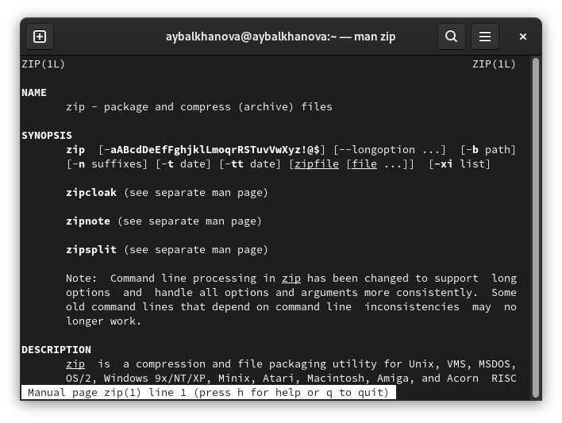
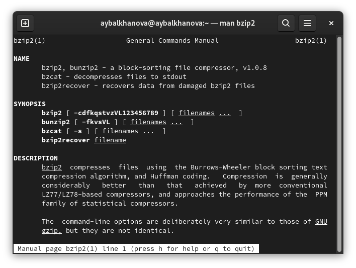
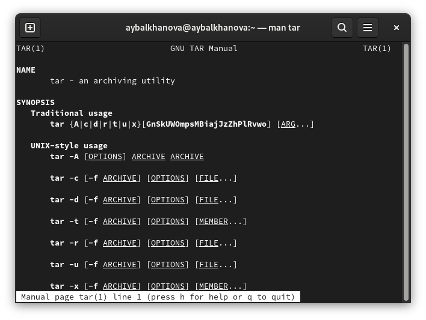
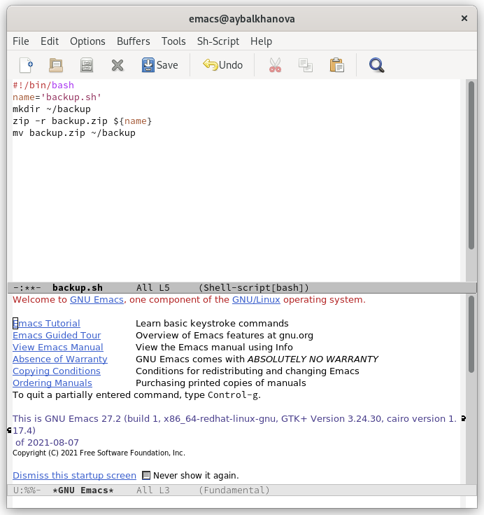
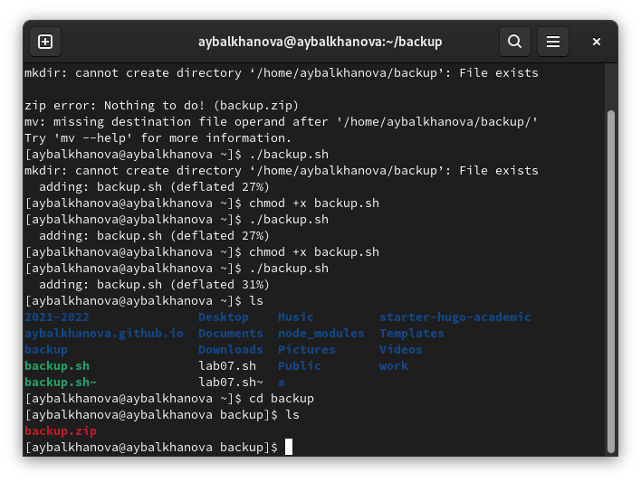
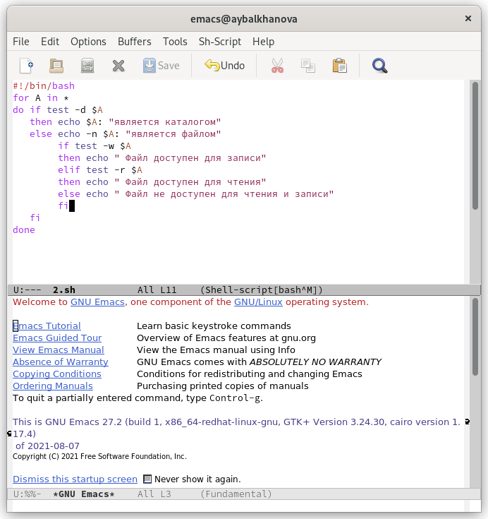
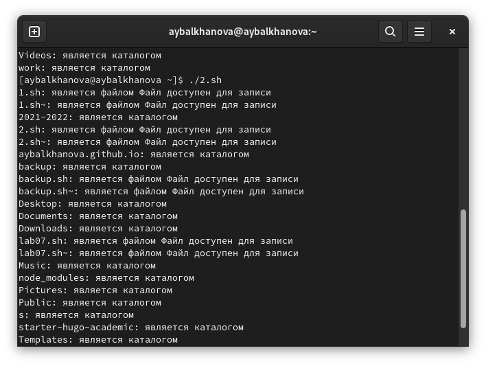

---
## Front matter
marp: true
lang: ru-RU
title: Презентация по лабораторной работе №10
author: |
	Балханова Алтана 
	НПМбд-03-21
institute: |
	\inst{1}RUDN University, Moscow, Russian Federation
date: NEC--2022, 28 April, 2022 Moscow, Russian Federation
## Formatting
toc: false
slide_level: 2
theme: metropolis
header-includes: 
 - \metroset{progressbar=frametitle,sectionpage=progressbar,numbering=fraction}
 - '\makeatletter'
 - '\beamer@ignorenonframefalse'
 - '\makeatother'
aspectratio: 43
section-titles: true
---

# Презентация по лабораторной работе №10
Балханова Алтана 
НПМбд-03-21
RUDN University, Moscow, Russian Federation
28 April, 2022 Moscow, Russian Federation

---

# Лабораторная работа №10

---

## Цель работы

Изучить основы программирования в оболочке ОС UNIX/Linux. Научиться писать небольшие командные файлы.

---

## Cправки архиваторов zip, bzip2, tar

---

---

---

{

---

## Резервное копирование

---

## Работа скрипта

---

## Аналог ls

---

## Проверила его работу ./2.sh.

---

## Вывод

Я изучила основы программирования в оболочке ОС UNIX/Linux и научилась писать небольшие командные файлы.

---

# Спасибо за внимание
