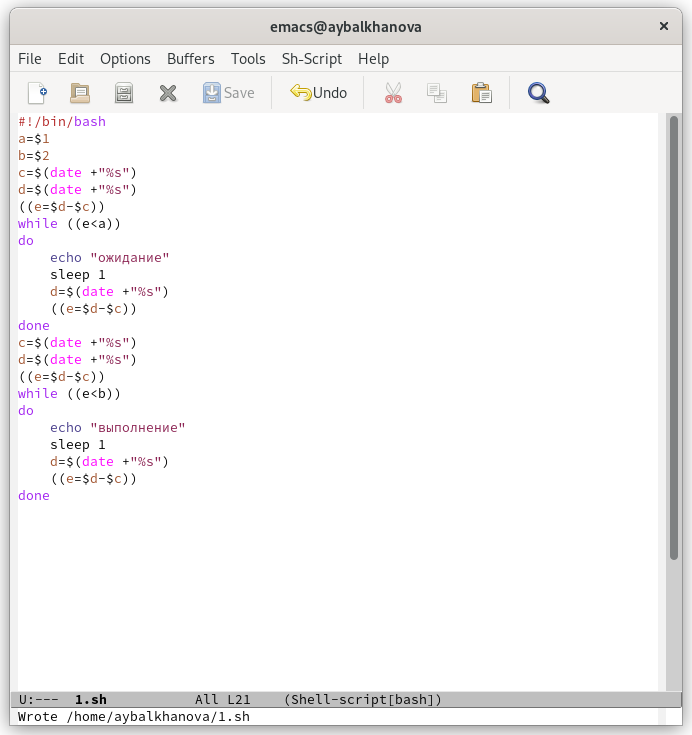
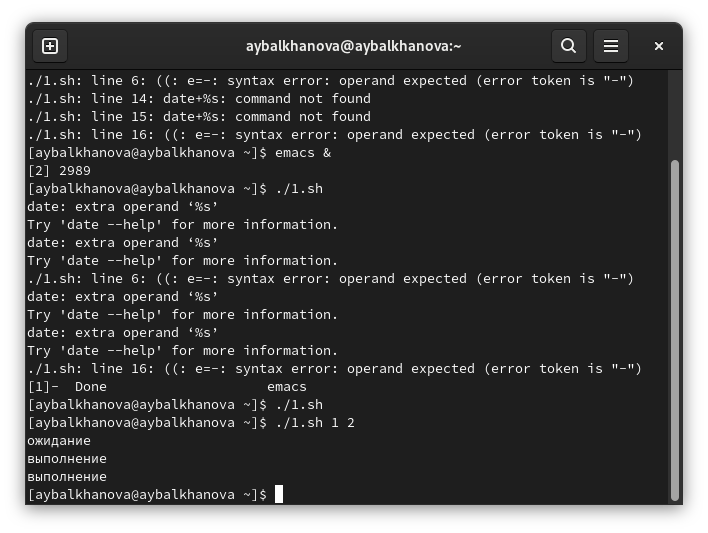
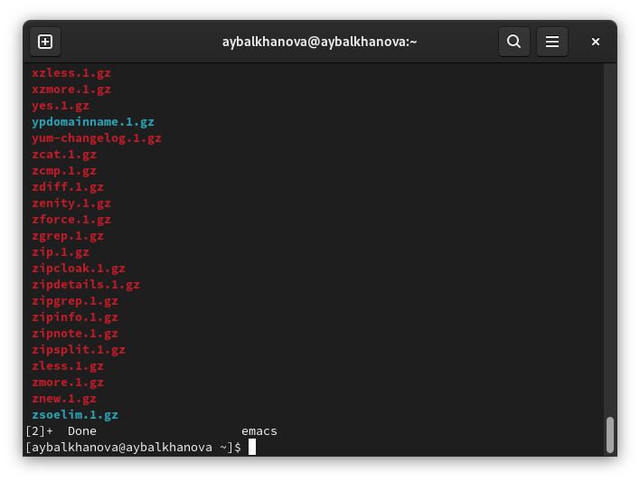
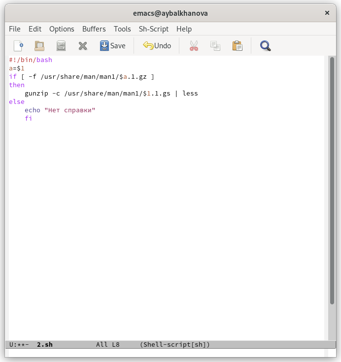
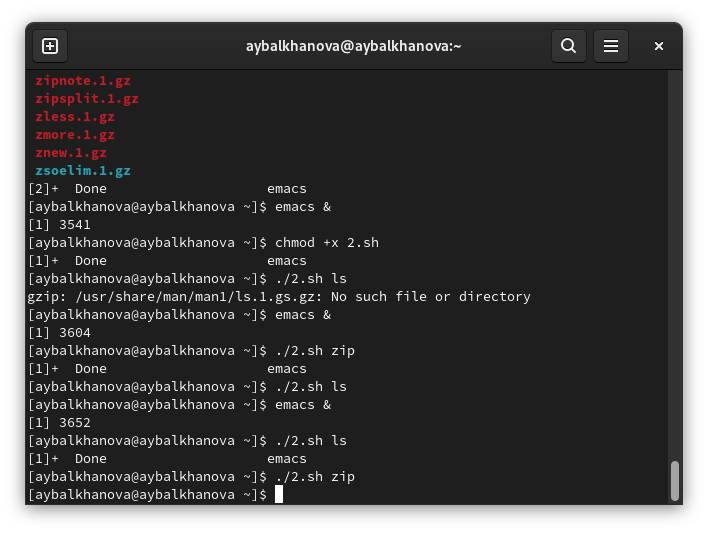
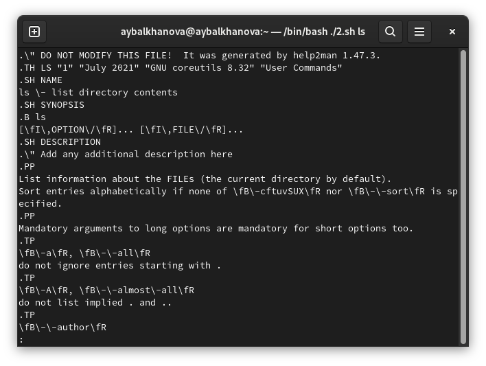
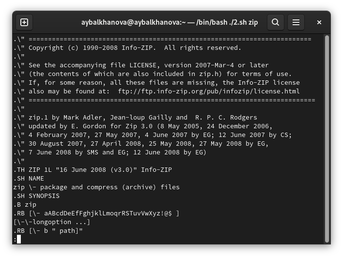
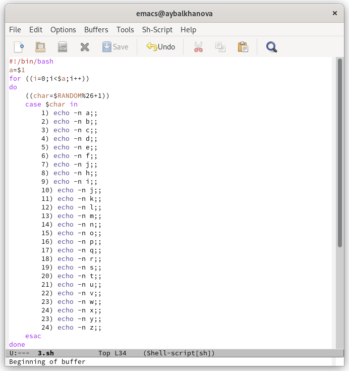
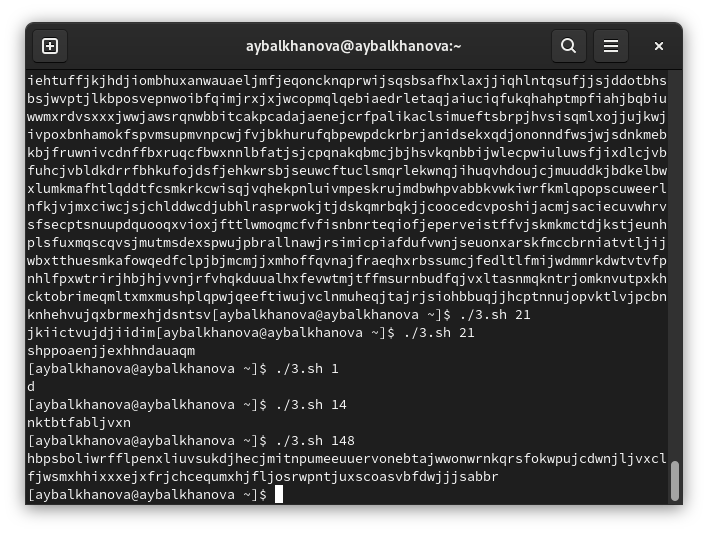

---
## Front matter
title: "Отчёт по лабораторной работе №12"
subtitle: "Операционные системы"
author: "Балханова Алтана Юрьевна"

## Generic otions
lang: ru-RU
toc-title: "Содержание"

## Bibliography
bibliography: bib/cite.bib
csl: pandoc/csl/gost-r-7-0-5-2008-numeric.csl

## Pdf output format
toc: true # Table of contents
toc-depth: 2
lof: true # List of figures
lot: true # List of tables
fontsize: 12pt
linestretch: 1.5
papersize: a4
documentclass: scrreprt
## I18n polyglossia
polyglossia-lang:
  name: russian
  options:
	- spelling=modern
	- babelshorthands=true
polyglossia-otherlangs:
  name: english
## I18n babel
babel-lang: russian
babel-otherlangs: english
## Fonts
mainfont: PT Serif
romanfont: PT Serif
sansfont: PT Sans
monofont: PT Mono
mainfontoptions: Ligatures=TeX
romanfontoptions: Ligatures=TeX
sansfontoptions: Ligatures=TeX,Scale=MatchLowercase
monofontoptions: Scale=MatchLowercase,Scale=0.9
## Biblatex
biblatex: true
biblio-style: "numeric"
biblatexoptions:
  - parentracker=true
  - backend=biber
  - hyperref=auto
  - language=auto
  - autolang=other*
  - citestyle=numeric
## Pandoc-crossref LaTeX customization
figureTitle: "Рис."
tableTitle: "Таблица"
listingTitle: "Листинг"
lofTitle: "Список иллюстраций"
lotTitle: "Список таблиц"
lolTitle: "Листинги"
## Misc options
indent: true
header-includes:
  - \usepackage{indentfirst}
  - \usepackage{float} # keep figures where there are in the text
  - \floatplacement{figure}{H} # keep figures where there are in the text
---

# Цель работы

Изучить основы программирования в оболочке ОС UNIX. Научиться писать более сложные командные файлы с использованием логических управляющих конструкций и циклов.

# Выполнение лабораторной работы
1. Я написала командный файл, реализующий упрощённый механизм семафоров. Командный файл должен в течение некоторого времени t1 дожидаться освобождения ресурса, выдавая об этом сообщение, а дождавшись его освобождения, использовать его в течение некоторого времени t2<>t1, также выдавая информацию о том, что ресурс используется соответствующим командным файлом (процессом). Запустила командный файл в одном виртуальном терминале в фоновом режиме, перенаправив его вывод в другой (> /dev/tty#, где # — номер терминала куда перенаправляется вывод), в котором также запущен этот файл, но не фоновом, а в привилегированном режиме. Доработала программу так, чтобы имелась возможность взаимодействия трёх и более процессов (рис. 0.1). 

	{ #fig:001 width=70% }
	
1. Проверила его работу (рис. 0.2). 

	{ #fig:001 width=70% }
	
1. Реализовала команду man с помощью командного файла. Изучила содержимое каталога /usr/share/man/man1. В нем находятся архивы текстовых файлов, содержащих справку по большинству установленных в системе программ и команд. Каждый архив можно открыть командой less сразу же просмотрев содержимое справки. Командный файл должен получать в виде аргумента командной строки название команды и в виде результата выдавать справку об этой команде или сообщение об отсутствии справки, если соответствующего файла нет в каталоге man1 (рис. 0.3, 0.4). 

	{ #fig:001 width=70% }
	
	{ #fig:001 width=70% }
	
1. Проверила его работу (рис. 0.5, 0.6, 0.7). 

	{ #fig:001 width=70% }
	
	{ #fig:001 width=70% }
	
	{ #fig:001 width=70% }
	
1. Используя встроенную переменную $RANDOM, написала командный файл, генерирующий случайную последовательность букв латинского алфавита. Учла, что $RANDOM выдаёт псевдослучайные числа в диапазоне от 0 до 32767 (рис. 0.8). 

	{ #fig:001 width=70% }
	
1. Проверила его работу (рис. 0.9). 

	{ #fig:001 width=70% }

# Контрольные вопросы
1. $1 не взяты в кавычки.
1. Для того чтобы объединить две строки, можно использовать += для двух переменных.
1. Эти утилиты выводят последовательность целых чисел с шагом, заданным пользователем. По умолчанию, выводимые числа отделяются друг от друга символом перевода строки, однако, с помощью ключа -s может быть задан другой разделитель.
1. Ответ - 3.
1. Zsh более интерактивный и настраиваемый, чем Bash. У Zsh есть поддержка с плавающей точкой, которой нет у Bash. В Zsh поддерживаются структуры хеш-данных, которых нет в Bash. Функции вызова в Bash лучше по сравнению с Zsh.
1. Да, синтаксис верен.
1. Bash и python. Bash, несомненно, обладает некоторыми преимуществами, в частности, универсальностью и доступностью. Для того, чтобы написать скрипт на Bash, установка дополнительных пакетов не требуется. Достаточно создать файл вида script_name.sh с последовательно исполняемыми операциями и запустить его, либо добавить в качестве задачи планировщика cron. Многие администраторы выбирают Bash для написания простых или средних по сложности скриптов. В крупных проектах, где есть специфические задачи и требуется работа с разнообразными входными данными, многомерными массивами и сокетами больше доверяют Perl, Python или Ruby. В отличие от Bash, Python является полноценным объектно-ориентированным языком программирования. Python удобочитаем и обладает компактным кодом, наличие большого количества модулей, подключаемых с помощью оператора import.

# Выводы

Я изучила основы программирования в оболочке ОС UNIX. Научилась писать более сложные командные файлы с использованием логических управляющих конструкций и циклов.
