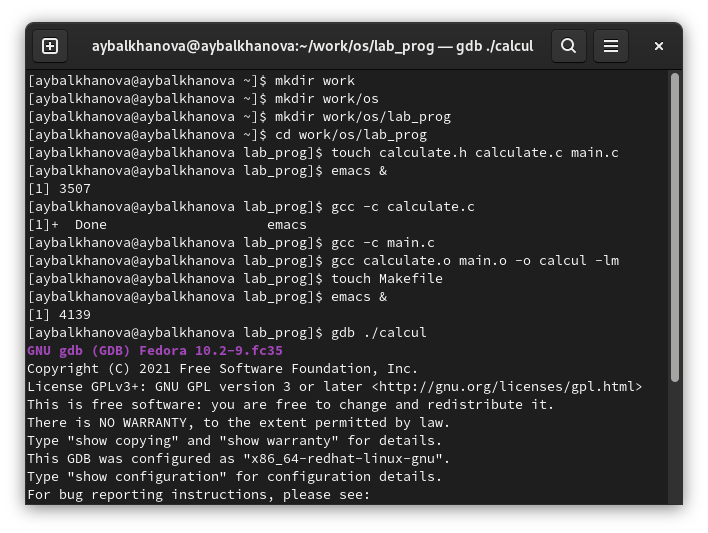
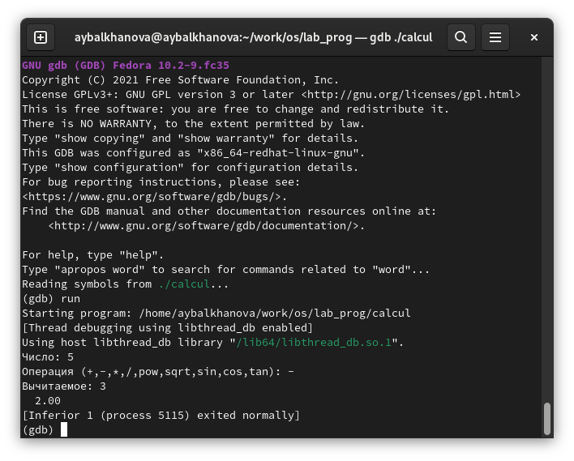

---
## Front matter
title: "Отчёт по лабораторной работе №13"
subtitle: "Операционные системы"
author: "Балханова Алтана Юрьевна"

## Generic otions
lang: ru-RU
toc-title: "Содержание"

## Bibliography
bibliography: bib/cite.bib
csl: pandoc/csl/gost-r-7-0-5-2008-numeric.csl

## Pdf output format
toc: true # Table of contents
toc-depth: 2
lof: true # List of figures
lot: true # List of tables
fontsize: 12pt
linestretch: 1.5
papersize: a4
documentclass: scrreprt
## I18n polyglossia
polyglossia-lang:
  name: russian
  options:
	- spelling=modern
	- babelshorthands=true
polyglossia-otherlangs:
  name: english
## I18n babel
babel-lang: russian
babel-otherlangs: english
## Fonts
mainfont: PT Serif
romanfont: PT Serif
sansfont: PT Sans
monofont: PT Mono
mainfontoptions: Ligatures=TeX
romanfontoptions: Ligatures=TeX
sansfontoptions: Ligatures=TeX,Scale=MatchLowercase
monofontoptions: Scale=MatchLowercase,Scale=0.9
## Biblatex
biblatex: true
biblio-style: "numeric"
biblatexoptions:
  - parentracker=true
  - backend=biber
  - hyperref=auto
  - language=auto
  - autolang=other*
  - citestyle=numeric
## Pandoc-crossref LaTeX customization
figureTitle: "Рис."
tableTitle: "Таблица"
listingTitle: "Листинг"
lofTitle: "Список иллюстраций"
lotTitle: "Список таблиц"
lolTitle: "Листинги"
## Misc options
indent: true
header-includes:
  - \usepackage{indentfirst}
  - \usepackage{float} # keep figures where there are in the text
  - \floatplacement{figure}{H} # keep figures where there are in the text
---

# Цель работы

Приобрести простейшие навыки разработки, анализа, тестирования и отладки приложений в ОС типа UNIX/Linux на примере создания на языке программирования С калькулятора с простейшими функциями.

# Выполнение лабораторной работы
1. В домашнем каталоге создала подкаталог ~/work/os/lab_prog. (рис. 0.1). 

	{ #fig:001 width=70% }
	
1. Создала в нём файлы: calculate.h, calculate.c, main.c. (рис. 0.2, 0.3, 0.4, 0.5). 

	{ #fig:001 width=70% }
	
	{ #fig:001 width=70% }
	
	{ #fig:001 width=70% }
	
	{ #fig:001 width=70% }
	
1. Выполнила компиляцию программы посредством gcc (рис. 0.6). 

	{ #fig:001 width=70% }
	
1. Создала Makefile со следующим содержанием (рис. 0.7): 

	{ #fig:001 width=70% }

Здесь в первой строке calcul — цель, calculate.o main.o — название файла, который мы хотим
скомпилировать; во второй строке, начиная с табуляции, задана команда компиляции
gcc с опциями.

1. С помощью gdb выполнила отладку программы calcul (перед использованием gdb исправила Makefile):

	1. Запустила отладчик GDB, загрузив в него программу для отладки (рис. 0.8): 

		{ #fig:001 width=70% }
		
	1.  Для запуска программы внутри отладчика ввела команду run (рис. 0.9): 

		{ #fig:001 width=70% }
		
	1. Для постраничного (по 9 строк) просмотра исходного код использовала команду list (рис. 0.10): 

		{ #fig:001 width=70% }
		
	1. Для просмотра строк с 12 по 15 основного файла используйте list с параметрами (рис. 0.11): 

		{ #fig:001 width=70% }
		
	1. Для просмотра определённых строк не основного файла используйте list с параметрами (рис. 0.12): 

		{ #fig:001 width=70% }
		
	1. Установила точку останова в файле calculate.c на строке номер 21 (рис. 0.13): 
		
		{ #fig:001 width=70% }
		
	1. Вывела информацию об имеющихся в проекте точка останова (рис. 0.14): 

		{ #fig:001 width=70% }
		
	1. Запустила программу внутри отладчика и убедилась, что программа остановится в момент прохождения точки останова (рис. 0.15): 

		{ #fig:001 width=70% }
		
	1. Посмотрела, чему равно на этом этапе значение переменной Numeral, введя (рис. 0.16): 

		{ #fig:001 width=70% }
		
	1. Сравнила с результатом вывода на экран после использования команды (рис. 0.17): 

		{ #fig:001 width=70% }
		
	1. Убрала точки останова (рис. 0.18): 

		{ #fig:001 width=70% }

1. С помощью утилиты splint попробуйте проанализировать коды файлов calculate.c и main.c (рис. 0.19, 0.20): 

	{ #fig:001 width=70% }
		
	{ #fig:001 width=70% }
	
# Контрольные вопросы
1. Используя команду man, можно узнать о вохможностя программ gcc, make, gdb и др.
1. Процесс разработки программного обеспечения обычно разделяется на следующие
этапы:
– планирование, включающее сбор и анализ требований к функционалу и другим характеристикам разрабатываемого приложения;
– проектирование, включающее в себя разработку базовых алгоритмов и спецификаций,
определение языка программирования;
– непосредственная разработка приложения:
– кодирование — по сути создание исходного текста программы (возможно
в нескольких вариантах);
– анализ разработанного кода;
– сборка, компиляция и разработка исполняемого модуля;
– тестирование и отладка, сохранение произведённых изменений;
– документирование.
Для создания исходного текста программы разработчик может воспользоваться любым
удобным для него редактором текста: vi, vim, mceditor, emacs, geany и др.
После завершения написания исходного кода программы (возможно состоящей из
нескольких файлов), необходимо её скомпилировать и получить исполняемый модуль.
1. Файлы с расширением (суффиксом) .c воспринимаются gcc как программы на языке
С, файлы с расширением .cc или .C — как файлы на языке C++, а файлы c расширением
.o считаются объектными. Таким образом, gcc по расширению (суффиксу) .c распознает тип файла для компиляции и формирует объектный модуль — файл с расширением .o.
1. Для сборки разрабатываемого приложения и собственно компиляции полезно воспользоваться утилитой make. Она позволяет автоматизировать процесс преобразования
файлов программы из одной формы в другую, отслеживает взаимосвязи между файлами.
1. hello: main.c
gcc -o hello main.c
Здесь в первой строке hello — цель, main.c — название файла, который мы хотим
скомпилировать; во второй строке, начиная с табуляции, задана команда компиляции
gcc с опциями.
1. backtrace вывод на экран пути к текущей точке останова (по сути вывод
названий всех функций)
break установить точку останова (в качестве параметра может быть
указан номер строки или название функции)
clear удалить все точки останова в функции
continue продолжить выполнение программы
delete удалить точку останова
display добавить выражение в список выражений, значения которых
отображаются при достижении точки останова программы
finish выполнить программу до момента выхода из функции
info breakpoints вывести на экран список используемых точек останова
info watchpoints вывести на экран список используемых контрольных выражений
list вывести на экран исходный код (в качестве параметра может
быть указано название файла и через двоеточие номера начальной и конечной строк)
next выполнить программу пошагово, но без выполнения вызываемых в программе функций
print вывести значение указываемого в качестве параметра выражения
run запуск программы на выполнение
set установить новое значение переменной
step пошаговое выполнение программы
watch установить контрольное выражение, при изменении значения
которого программа будет остановлена
1. Для использования GDB необходимо скомпилировать анализируемый код программы
таким образом, чтобы отладочная информация содержалась в результирующем бинарном
файле. После этого для начала работы с gdb необходимо в командной строке ввести одноимённую команду, указав в качестве аргумента анализируемый бинарный файл. Затем можно использовать по мере необходимости различные команды gdb: run, backtrace, delete, display, list, ingo brealpoints.
1. Для облегчения понимания исходного кода используются комментарии.
1. анализатор splint генерирует комментарии с описанием
разбора кода программы и осуществляет общий контроль, обнаруживая такие ошибки,
как одинаковые объекты, определённые в разных файлах, или объекты, чьи значения не
используются в работе программы, переменные с некорректно заданными значениями
и типами и многое другое.

# Выводы

Я приобрела простейшие навыки разработки, анализа, тестирования и отладки приложений в ОС типа UNIX/Linux на примере создания на языке программирования С калькулятора с простейшими функциями.
